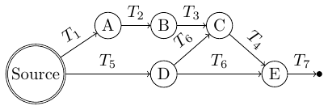
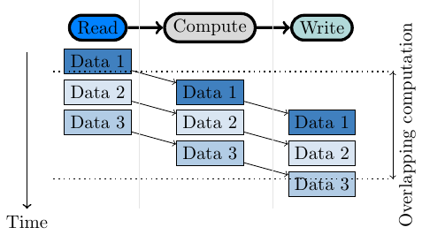
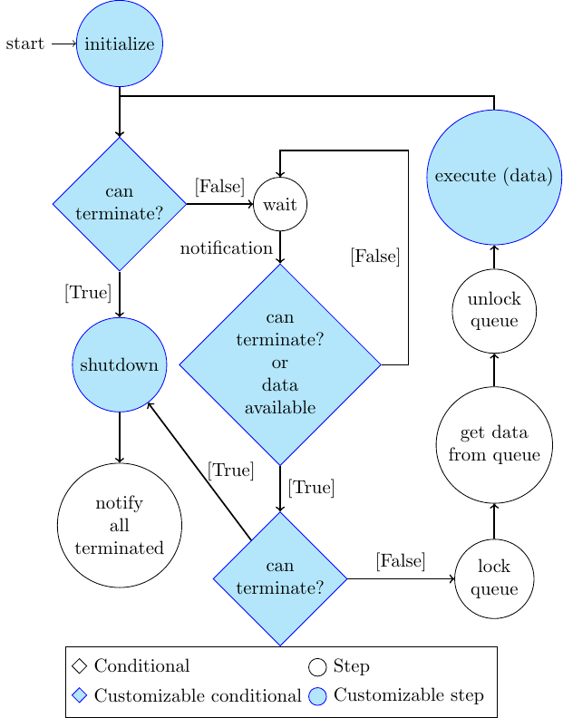

# Introduction

Thank you for your interest in this library.

The Hedgehog library aids developers in creating dataflow graphs. These dataflow graphs are used to implement algorithms that execute on heterogenous computers.
This preamble is made to present what Hedgehog is and its execution model.

For more details, please see our publications: ([DOI: 10.1109/PAWATM51920.2020.00006](https://doi.org/10.1109/PAWATM51920.2020.00006)).

The current version of Hedgehog is version 3, if you have used Hedgehog version 2 before we have a [section](z_hh2tohh3.html) to help you port your code.  

# Execution models 

## Dataflow graph 

Hedgehog presents an algorithm under the form of a dataflow graph. 
The nodes of the graph are the computational kernels and the vertices presents the flow of data.
The graph is a logical bundle of nodes and edges. 
In addition, a graph is a node in Hedgehog, it is possible to compose graphs together. 

A simple graph representation looks like this: 

A, B, C, D, and E are the computational kernels, and T1, T2, T3, T4, T5, T6, and T7 are the different types of data flowing into the graph. 

The graph is static and explicit. 
What is designed, is what is executed without transformation. 
The data flowing through the edges are actually *std::shared_ptr* wrapping the data between the nodes. 
If a node has multiple successors for a type, the *std::shared_ptr* is copied to each of the successors.

Hedgehog's dataflow graphs can be created in many different ways and allow cycles. However, cycles must be handled with care, as presented in [Tutorial 4 - Cycle resolution: CPU Matrix Multiplication](tutorial4.html).

The creation of such graphs in Hedgehog and its various abstractions are covered in detail within these [https://github.com/ABardakoff/New_Hedgehog_tutorials](tutorials).

Other conceptual differences between Hedgehog and other libraries are highlighted in this [section](#main-differences-with-a-task-graph-model).

## Threading model

By default, each computational node (task) is attached to one (or more) threads since its creation to its destruction. These threads are persistent to the computational node it is attached too, and do not traverse other nodes in the graph. Threads execute based on the prescence of data. If there is no data prescent, then the thread will enter a wait state, releasing CPU resources. By default, the thread will infinitely process data for that computational node until the connection to the computational node is disconnected and the data queue is empty.
The thread management is solely done by the OS; we rely on it and not on a scheduler to avoid extra computations and extra latency.
However, Hedgehog has a scheduler abstraction for customizing this behavior.

## Data pipelining

To gain performance, Hedgehog relies on data pipelining and thread group parallelism.

If computational nodes are executing independently and the output of some are inputs of others, you have inherent parallelism and computations overlap.
This can be used to effectively overlap different kinds of computations, for example IO with kernel execution. Additionally, a thread group can process data in parallel if there is sufficient data waiting to be processed.

This technique works best if *big enough* pieces of data are sent into the graph.
The latency (transfer time between two nodes) of the system is ~10 us in most cases. 

Computational nodes for example have thread-safe queues (one per input type) protected by a mutex.
The mutex must be locked when data is sent to the task and acquired by the task, and then unlocked prior to executing on the data. In a thread group another thread can then acquire that mutex to fetch the next piece of data and work on different data in parallel.

We consider Hedgehog to be a *coarse gain* library, the nodes are not meant to do computations on a single value, but on blocks of data. Ideally, there will be sufficient computation on data to justify the costs of sending data. Fine-grained parallelism is often done within a node by applying various high performance techniques or calling optimized library functions on data, such as OpenCV, OpenBLAS, or FFTW libraries to name a few.

Understanding the performance impliciations of the Hedgehog graph can be visualized by taking advantage of its zero-overhead [profiling tools](#profiling-tools)

## Main differences with a task graph model

Hedgehog uses a static and explicit dataflow graph and does not follow the traditional task graph design.

Typical task graphs work as follows:
The library analyses an algorithm representation created by the end-user, may apply a transformation to it, and analyses the node dependencies.
Then, when a node is ready to be fired, the runtime system attaches the kernel to a thread from a pool thanks to a scheduler.
Then the output data are gathered and the following nodes are fired. 

Hedgehog operates in a way that does not change its underlying dataflow graph structure. The way in which the user constructs the dataflow graph is not modified by Hedgehog and is exactly what is executed.

When the graph is executed, the computational nodes are attached to threads.
The threads stay bound to the nodes until there is no more data to be processed by the task (cf. [Threading model](#threading-model) and [Task logic](#task-logic)).
However, a thread won't be executing at all times, it can enter a wait state if there is nothing to process, which frees up resources.
Once data arrives to a node, the thread is signaled to wake up by its predessor node so that it can fetch data from its queue, and then processes it (cf. [Data pipelining](#data-pipelining)).  This procedure is handled by the operating system.

In this structure, Hedgehog does not operate with a scheduler, the node execution is only triggered by the arrival or the presence of data in its input queues. 

## Task logic

Once attached to a thread the task follows this logic: 

The steps in blue are the ones that can be customized by an end-user:
- Initialize: executed once when the task is attached to the thread, 
- Shutdown: executed once when the task is about to terminate, 
- Execute: the computational kernel implementation / what it executed when a piece of data is acquired by the task, 
- Can terminate: condition termination ([Tutorial 4]({{site.url}}/tutorials/tutorial4)).

So, when a task's thread is attached, it:
1. Call initialize, 
2. If it can terminate:  
    - Call shutdown 
    - Notify successor node\[s\] for node's termination
    - Detach the thread
    - Terminate
3. Enter a wait state until a piece of data is sent and the node is notified or gets notified by predecessor termination
4. If it can terminate:
    - Call shutdown
    - Notify successor node\[s\] for node's termination
    - Detach the thread
    - Terminate
5. Lock an input queue
6. Get a piece of data out of an input queue
7. Unlock the queue
8. Call execute with the piece of data
9. Go to 2

It is important to understand that a task's thread starts when the graph is executed.
It continues to run until all predecessor nodes are terminated and no input data is available (or the redefined *canTerminate* method returns true).
The termination of the graph's input nodes is triggered when the end-user calls *Graph::finishPushingData()*. This will indicate to the input nodes that there is no longer data being sent into the graph.

The state managers works similarly to the task, but with a customized execute method: 
1. lock the state,
2. call the state's execute method with the piece of data,
3. wait for the state to finish processing the data,
4. gather all output data produced by the state,
5. unlock the state, 
6. send the output data to the successor nodes. 

# Gain performance with Hedgehog

## Design

The first step to create a performant algorithm implementation is to use a pen and paper and decompose the algorithm into independent pieces.
Each of the pieces translates into a node in a Hedgehog graph. The edges represents the data needed to process a step in the algorithm.
The choice of the node abstraction is of importance, that is why the first three tutorials are meant to present the main abstractions.

## Profiling tools

Once designed and implemented, we have added multiple tools that help to detect flaws in the design, showing bottlenecks and concurrency between the nodes.
The main tools have been showed to be costless, and we recommend to use it for every implementation. 
This [section](y_profiling.html) covers the different profiling mechanisms. 

# Structure of the tutorials

We have designed the tutorials to give a progressive explanations on the different tools and options available in the library:
- [Tutorial 1]({{site.url}}/tutorials/tutorial1) explains how to build a basic *graph* with a basic *task*. 
- [Tutorial 2]({{site.url}}/tutorials/tutorial2) introduces the *state* and *state manager* nodes for managing computations. 
- [Tutorial 3]({{site.url}}/tutorials/tutorial3) showcases the importance of data coarseness and how to clean a graph for multiple computations. 
- [Tutorial 4]({{site.url}}/tutorials/tutorial4) shows how to solve problems with *cycles* in Hedgehog. 
- [Tutorial 5]({{site.url}}/tutorials/tutorial5) presents *GPU computation* on NVIDIA GPUs. 
- [Tutorial 6]({{site.url}}/tutorials/tutorial6) extends the previous tutorial by porting it to multiple-GPUs with an *execution pipeline* and using *graph composition*.
- [Tutorial 7]({{site.url}}/tutorials/tutorial7) exposes the compile-time analysis tool library.
