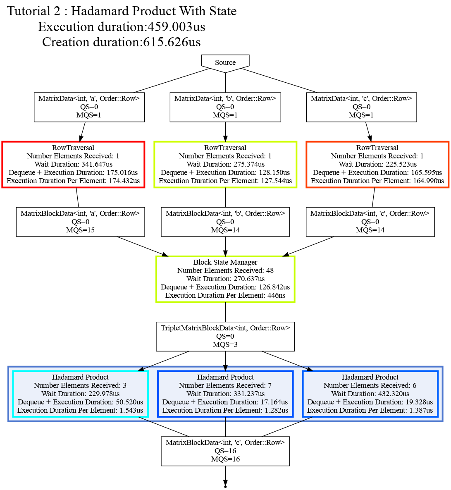

# Content
- [Goal](#goal)
- [Computation](#computation)
- [Data structure](#data-structure)
- [State and State Manager](#state-and-state-manager)
- [Task](#computation-task)
- [Graph](#graph)
- [Conclusion](#conclusion)

----

# Goal
The second tutorial aims to reuse the Hadamard (element-wise) product of two matrices A and B from [tutorial 1]({{site.url}}/tutorials/tutorial1) to introduce the concept of *multiple inputs*, *state*, and *state manager*. 

Here is the base API that will be presented in this tutorial: 
* Manage the state of the computation,
* Define a task with multiple inputs.

----

# Computation
The computation is decomposed as follows:
1. Decompose the matrices into blocks (inside the graph), 
2. Do the element-wise product of A and B, and store the result into C.
Because the decomposition of A, B, and C takes place within the graph, it is required to manage the state of the computation to be able to build the correct triplet for blocks A, B, and C. This is because the order in which blocks flow through the graph are non-determinstic.

----

# Data structure
We will use the same data structures as [tutorial 1]({{site.url}}/tutorials/tutorial1): 
* MatrixData<T, Id, Order>: A matrix, 
* MatrixBlockData<T, Id, Order>: A matrix block, 
* TripleMatrixBlockData<T, Order>: The corresponding block from matrix A, matrix B and matrix C.

These data structures are specialized with the following elements:
* Type: The type of the matrix elements, 
* Id: The matrix identifier, a, b, or, c,
* Ord: The way the matrix is ordered, row based, or, column based. 

----

# State and State Manager

While tasks are meant to achieve computations, we added a special type of node for managing the state of computations.
In Hedgehog, the management of status is localized, being only responsible for handling the state between connected nodes. There is no built-in representation of the global state in the Hedgehog API.
This type of node is represented by the StateManager class.
Technically a StateManager is a task limited to only one thread, requiring a State object at construction.
State is an object used to express the data synchronization strategy of a set of nodes handled by a state manager.

For example, we used blocks to parallelize the computation in the previous tutorial.
*MatrixData* A, B, and C are fed into the algorithm.
Input tasks (*MatrixRowTraversalTask*) will decompose them into blocks.
The first step of the algorithm will be to multiply these blocks of matrices together.
The problem is that elements within A should be multiplied by their corresponding elements in B and stored in the correct location in C. The order in which these blocks are sent from the *MatrixRowTraversalTask* is non-deterministic, so we need to wait until corresponding blocks are received before sending them for element-wise multiplication.
In order to manage the blocks coming from the decomposition tasks and forming the compatible pairs we use a StateManager and a State.
The State holds a representation of the grid of blocks, retains them until a compatible pair is possible, forms the pair of blocks and sends it to the *HadamardProduct* task.

To manage the state of computation two C++ objects are needed:
1. An abstract state: The object that will represent the state itself. It will hold the data structures that are needed to manage the state of the computation. 
2. A state manager task: A Hedgehog node that will execute the state with data sent to task and produce data sent from the state for the next task in the dataflow. 

To demonstrate the usage of the *state* and *state manager*, the code of the *BlockState* will be explained.

----

# State
In this computation, we want to form a triplet of blocks from the blocks of matrix A, matrix B, and matrix C. 
To achieve that we create a class *BlockState* as follows:

```cpp
template<class Type, Order Ord>
class BlockState : public hh::AbstractState<
    3,
    MatrixBlockData<Type, 'a', Ord>, MatrixBlockData<Type, 'b', Ord>, MatrixBlockData<Type, 'c', Ord>,
    TripletMatrixBlockData<Type, Ord>>;
```

We note here:
1. The declaration follows the same ordering as the *AbstractTask*, separator first then the list of types, 
2. There are multiple input types: Nodes in Hedgehog can accept multiple inputs, such as the *graph*, *state*, or *task*.

The multiple inputs imply:
1. The node can accept data from nodes that produce one of its input types.
2. The different types of inputs are received and handled independently of the others.
3. Multiple execute method will need to be defined, one for each input type.
4. The order in which the input types are received are non-deterministic and will executed one at a time.

```cpp
void execute(std::shared_ptr<MatrixBlockData<Type, 'a', Ord>> ptr) override { /*[...]*/ }
void execute(std::shared_ptr<MatrixBlockData<Type, 'b', Ord>> ptr) override { /*[...]*/ }
void execute(std::shared_ptr<MatrixBlockData<Type, 'c', Ord>> ptr) override { /*[...]*/ }
```

Contrary to the task, the state does not provide their results directly to another node, but their results are transferred to the *state manager* that will manage it. 
Data is enqueued by the state by using the addResult method:
```cpp
void execute(std::shared_ptr<MatrixBlockData<Type, 'a', Ord>> ptr) override {
  /*[...]*/
  this->addResult(triplet);
}
```

In our example, we can receive any block (in any order) of matrix A, B or C, and we will produce a triplet of these blocks only if they correspond with each other: they represent the same part of the matrix. 
When corresponding blocks are not available, a block is stored to await for the matching block(s) to arrive later. 

For each type of matrix, we define a temporary storage for these blocks with accessors that permits the storage and receiving of these blocks. 
We use this storage to test if a triplet of blocks is available and remove the blocks from the storage when they are pushed to the next task. 
For the storage of blocks from matrix A we will have:

```cpp
private:
// The temporary storage data structure
std::vector<std::shared_ptr<MatrixBlockData<Type, 'a', Ord>>> gridMatrixA_ = {}; 

// The getter
std::shared_ptr<MatrixBlockData<Type, 'a', Ord>> matrixA(size_t i, size_t j) {
  return gridMatrixA_[i * gridWidth_ + j];
}

// The setter
void matrixA(std::shared_ptr<MatrixBlockData<Type, 'a', Ord>> blockA){
  gridMatrixA_[blockA->rowIdx() * gridWidth_ + blockA->colIdx()] = blockA;
}

// The method to remove it
void resetA(size_t i, size_t j){ gridMatrixA_[i * gridWidth_ + j] = nullptr; }
```

The computation will be almost the same for each of the input types:
```cpp
void execute(std::shared_ptr<MatrixBlockData<Type, 'a', Ord>> ptr) override {
  std::shared_ptr<MatrixBlockData<Type, 'b', Ord>> blockB = nullptr;
  std::shared_ptr<MatrixBlockData<Type, 'c', Ord>> blockC = nullptr;

  // We get the position of the block inside the grid of blocks
  auto
    rowIdx = ptr->rowIdx(),
    colIdx = ptr->colIdx();

  // We get and test if the other corresponding blocks are available 
  if((blockB = matrixB(rowIdx, colIdx)) && (blockC = matrixC(rowIdx, colIdx))){
    // If they are we remove them from the data structure
    resetB(rowIdx, colIdx);
    resetC(rowIdx, colIdx);
    // We create the triplet
    auto triplet = std::make_shared<TripletMatrixBlockData<Type, Ord>>();
    triplet->a_ = ptr;
    triplet->b_ = blockB;
    triplet->c_ = blockC;
    // We transfer it to the state manager
    this->addResult(triplet);
  }else{
    // If not, we store the block
    matrixA(ptr);
  }
}
```

With this code we achieve a synchronization point for matrices A, B, and C, which is independent of the traversal. 

State is accessed synchronously by the *state manager* via locks that are built-in to the state. 
This ensures that there will be no race conditions when calling the execute method.

----

# State Manager
The *state manager*, is a type of node, that holds *state*. 

The *state manager*, fired with an input type, will sequentially process the data in the following order:
1. lock the *state*, 
2. call the *state* execute with the input data, 
3. gather the outputs from the *state*,
4. add the outputs to its output edge
5. unlock the *state*. 

To note, multiple *state managers* are allowed to hold the same *state* instance, so it's possible to share the *state* at different points in the graph. 
Because it's locked, the computation into a state should be as minimal and as fast as possible. 

In this tutorial, we use Hedgehog's default state manager, that is created as follows: 
```cpp
// Declaring and instantiating the state and state manager
auto inputState = std::make_shared<BlockState<MatrixType, Ord>>(matrixA->numBlocksRows(), matrixA->numBlocksCols());
auto inputstateManager =
    std::make_shared<
        hh::StateManager<
            3,
            MatrixBlockData<MatrixType, 'a', Ord>, MatrixBlockData<MatrixType, 'b', Ord>, MatrixBlockData<MatrixType, 'c', Ord>,
            TripletMatrixBlockData<MatrixType, Ord>
        >
    >(inputState, "Block State Manager");
```

----

# Computation task
We reuse the same task as shown in [tutorial 1]({{site.url}}/tutorials/tutorial1).

The *MatrixRowTraversalTask* is used to produce the different blocks from each matrix, which are gathered and distributed for corresponding triplets by the *state manager* to the computation task.

----

# Graph
The graph from [tutorial 1]({{site.url}}/tutorials/tutorial1) is changed slightly to operate with receiving three types of *MatrixData* for A, B, and C.
  

Below is the graph construction, the connection to the input of the graph must match at least one of the task input(s) and the output of the graph must match the output of task output.
```cpp
// Set The hadamard task as the task that will be connected to the graph inputs
graphHadamard.inputs(taskTraversalA);
graphHadamard.inputs(taskTraversalB);
graphHadamard.inputs(taskTraversalC);

// Link the traversal tasks to the input state manager
graphHadamard.edges(taskTraversalA, inputstateManager);
graphHadamard.edges(taskTraversalB, inputstateManager);
graphHadamard.edges(taskTraversalC, inputstateManager);

// Link the input state manager to the hadamard product
graphHadamard.edges(inputstateManager, hadamardProduct);

// Set The hadamard task as the task that will be connected to the graph output
graphHadamard.outputs(hadamardProduct);
```

And here is the visualization:



----

# Conclusion
In this tutorial, we have demonstrated:
* How to create state,  
* How to use the default state manager, 
* How to use multiple input types.
