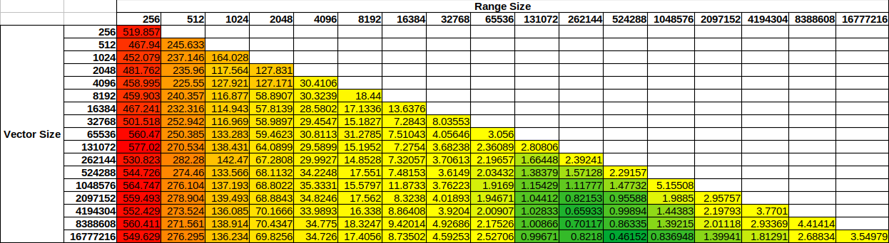
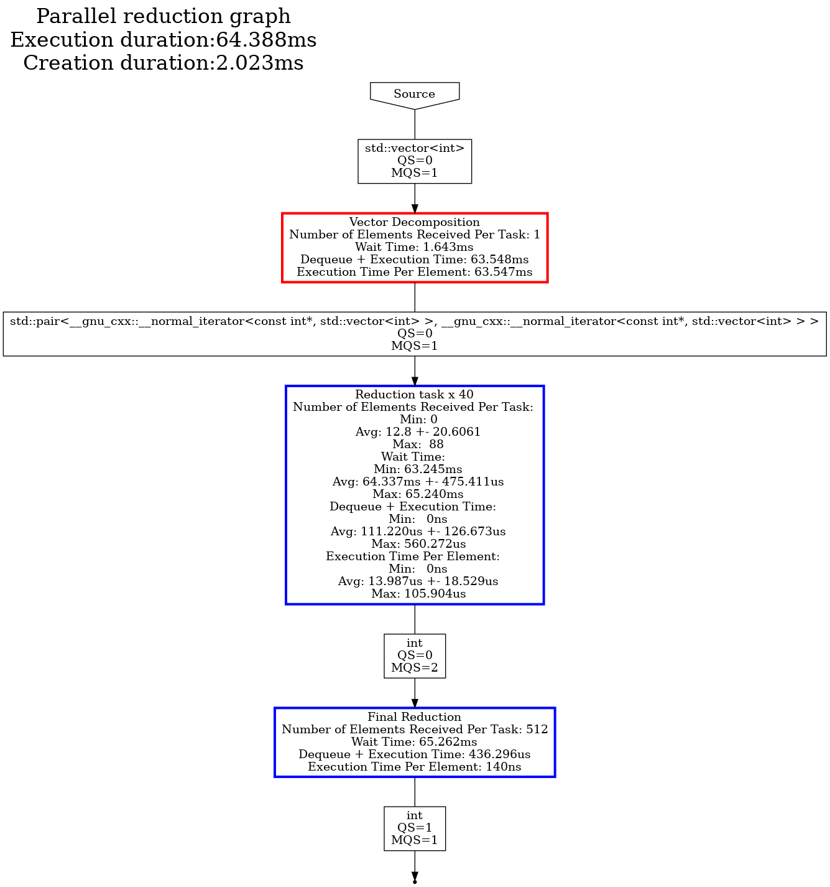
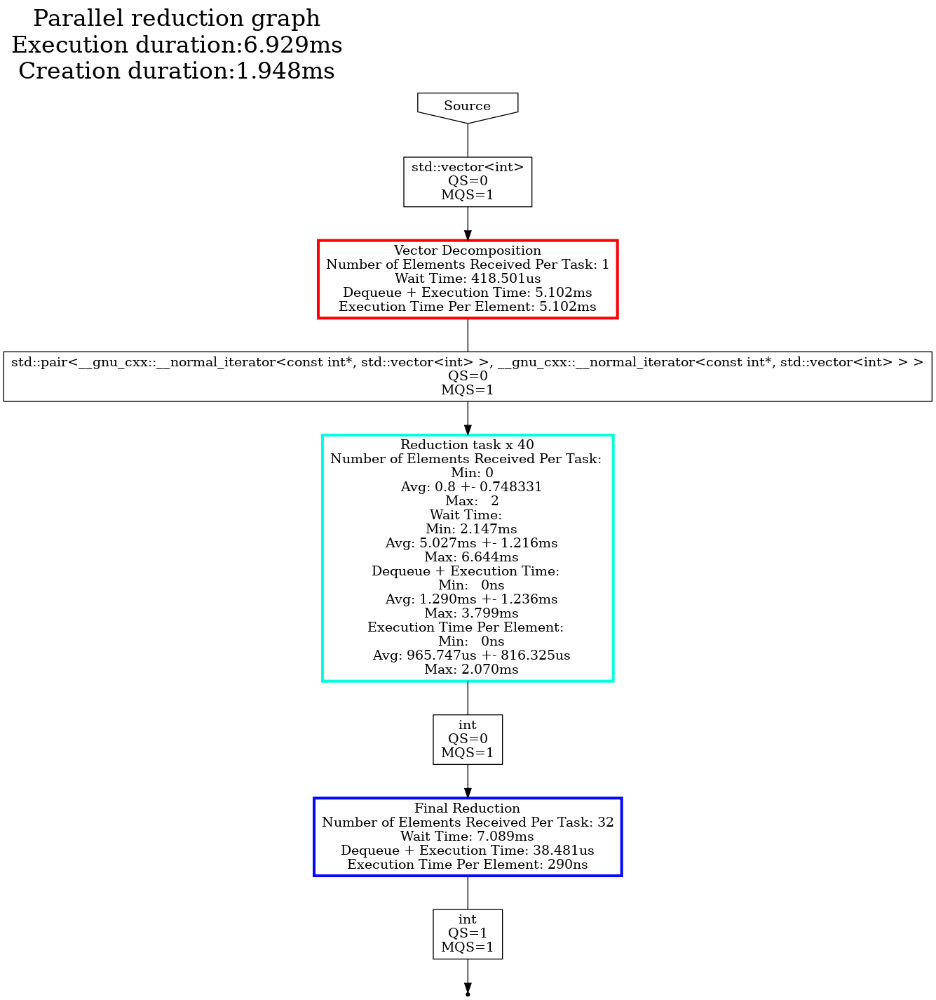

# Content

- [Goal](#goal)
- [Computation](#computation)
- [Tasks](#computation-tasks)
- [Graph](#graph---multiple-computation---graph-cleaning)
- [Performance](#performance)
- [Conclusion](#conclusion)

---

# Goal

The goal of this tutorial is to propose an implementation of a parallel reduction algorithm.
In it, we showcase the usage of doing a fine grain computation and the cleaning API.
Additionally, we present how we can reuse a graph for multiple computations.

---

# Computation

The principle of this algorithm is to reduce a collection of data (here a vector of ints) down to a single value with a
specific operation.
This operation needs to be associative and commutative in nature.

A naive implementation would be to apply this operation in all elements in the collection consecutively.
We would like to propose a parallel implementation, our strategy is to decompose the vector to process small parts of
it.
The parts are then reduced in parallel producing partial results.
These are then reduced down to a single result value.

The input vector is considered as read-only, and won't be writte too.

We propose the following implementation:

1. Decompose the vector into parts (VectorDecomposition),
2. Reduce these vectors down to partial results (ReductionTask),
3. Do the reduction of the partial results (FinalReductionTask).

--- 

# Computation tasks

## Vector Decomposition

We consider the vector as read-only.
In order to avoid extra copies or constructions of smaller vectors, the task produces a pair of iterators.
The iterators represents the range \[begin, end\] that need to be reduced.
These ranges will be processed in parallel in the next task.

Below is the task definition:

```cpp
template<class DataType>
class VectorDecomposition :
    public hh::AbstractTask<1,
                            std::vector<DataType>,
                            std::pair<typename std::vector<DataType>::const_iterator,
                                      typename std::vector<DataType>::const_iterator>>;
```

The decomposition strategy is implemented as:

```cpp
void execute(std::shared_ptr<std::vector<DataType>> v) override {
    if (v->size() < blockSize_) {
        throw std::runtime_error("The number of blocks is larger than the given vector of data.");
    }
  if (v->empty()) {
    finalReductionType_->numberReductedBlocks(1);
    this->addResult(
        std::make_shared<
            std::pair<typename std::vector<DataType>::const_iterator, typename std::vector<DataType>::const_iterator>>(
                v->cbegin(), v->cend()));
  } else {
    finalReductionType_->numberReductedBlocks((size_t) std::ceil((double) v->size() / (double) (blockSize_)));
    auto begin = v->begin();
    auto endIt = v->begin();
    long endPosition = 0;
    while (endIt != v->end()) {
     endPosition = (long) std::min((size_t) endPosition + blockSize_, v->size());
     endIt = v->begin() + endPosition;
     this->addResult(std::make_shared<std::pair<
         typename std::vector<DataType>::const_iterator,
         typename std::vector<DataType>::const_iterator>>(begin, endIt));
     begin = endIt;
    }
  }
}
```

## Main parallel reduction task

The parallel reduction is meant to reduce a range of data from the vector down to a single value. 
In the main case, we do the reduction by calling *std::reduce* on the range of data with the lambda given by the end-user.

```cpp
this->addResult(
    std::make_shared<DataType>(std::reduce(data->first + 1, data->second, *(data->first), lambda_))
    );
```

We want to do this in parallel, so we create a group of tasks by setting the number of threads attached to the task >1 and implementing the copy function: 

```cpp
  ReductionTask(size_t const numberThreads, std::function<DataType(DataType const &, DataType const &)> lambda)
  : hh::AbstractTask<
      1,
      std::pair<typename std::vector<DataType>::const_iterator, typename std::vector<DataType>::const_iterator>,
      DataType>
  ("Reduction task", numberThreads), lambda_(std::move(lambda)) {}

std::shared_ptr<hh::AbstractTask<
    1,
    std::pair<typename std::vector<DataType>::const_iterator, typename std::vector<DataType>::const_iterator>,
    DataType>> 
    copy() override {
      return std::make_shared<ReductionTask<DataType>>(this->numberThreads(), lambda_);
}
```

The lambda, given as a parameter, is the operation that will be applied to each element to reduce them.

## Final reduction task

The purpose of this task is to reduce the partial results from the previous *ReductionTask* down to a single value.
We have chosen to use a single-threaded task for this implementation because: 
- The processing is lightweight compared to the *ReductionTask*'s one, 
- We didn't want to pay the cost of synchronization

When the *VectorDecomposition* task gets a vector it updates the *FinalReductionTask*'s number of partial results it needs to process. 
This only works if we wait for the computation to go through before we send another input vector of data. 

In addition, before processing another input we need to reset the attributes of the task. 
This is why we have overloaded the *clean* method. 

```cpp
  void clean() override {
    stored_ = nullptr;
    numberReductedBlocks_ = 0;
  }
```

This is meant to clean the task to be able to process a new computation. 
The other tasks do not maintain anything to do their computation, that is why we have not overloaded the *clean* method.

Alternatively, a more efficient methodology would use a unique identifier to mark each vector. This would be used by the *FinalReductionTask* to identify which data point belongs to which, allowing multiple vectors to be reduced in parallel. However for the sake of this example, we want to demonstrate the cleaning behavior.


--- 

# Graph - Multiple computation - Graph cleaning

The way we use the graph is slightly different from the one used in other tutorials because we want to reuse it for multiple computations. 
Usually, the sequence of operation for a graph is: 
1) Instantiate the graph,
2) Build the graph,
3) Execute the graph,
4) Push the inputs, 
5) Indicate no more input is sent to the graph (that start the graph termination),
6) Loop over the produced results,
7) Wait for the graph to fully terminates.


Here, we follow this logic:
1) Instantiate the graph,
2) Build the graph,
3) Execute the graph,
4) For each input vector
   1) Push an input data,
   2) Get the result,
   3) Clean the graph,
5) Indicate no more input is sent to the graph (starts the graph termination),
6) Wait for the graph to fully terminates.

We are reusing the graph: for a given range size, we reduce multiple vectors.  
This works because we know that for one input given we have one output. 
If we were to wait for *n results* we would need to call *n* times the *graph::getBlockingResult()* method. 
Looping over the output results with a while loop (as presented in other tutorials) won't work because *finishPushingData* is not invoked before getting the output results (the while loop never breaks because the graph would only return nullptr when it is terminated).

---

# Performance

To make the algorithm coarse, we decompose the input data into ranges and process each range in parallel. This ensures there is sufficient data to compensate for Hedgehog's latency when sending data in the dataflow. 
Additionally, the coarseness of the data has a huge impacts on the performance depending on your computer.

To present some performance results and to showcase these impacts we have run different experiments 20 times each with different input data sizes and range sizes.
We compute the average end-to-end computation time in nanoseconds and the standard deviation. 

To compare these results together, we have divided the average computation time by the number of data in the input vector. 
On a test computer with an Intel(R) Xeon(R) Silver 4114 CPU @ 2.20GHz with 40 logical cores (20 physical) and 196 GB memory ram we have the following results:



The color scheme is chosen as follows: green for the minimum value, yellow for the 20th percentile, and red for the maximum value.

The first remark is the speedup between the maximum value and the minimum value is about 1250x ! 

Then, we see that the best performance is neither too small nor too big.
The first is limited by the latency (cost of sending data between nodes) compared to the cost of the computation. 
The second is limited due to not have sufficient data flowing through the graph and will not benefit from the available parallelism on this computer.

To generate the dot files we execute the following code:
```cpp
{
   auto v = std::make_shared<std::vector<DataType>>(131072, 1);
   ParallelReductionGraph<DataType> graph(addition, 256, std::thread::hardware_concurrency());
   graph.executeGraph();
   graph.pushData(v);
   graph.finishPushingData();
   graph.waitForTermination();
   graph.createDotFile("131072_256.dot", hh::ColorScheme::EXECUTION, hh::StructureOptions::QUEUE);
}

{
   auto v = std::make_shared<std::vector<DataType>>(16777216, 1);
   ParallelReductionGraph<DataType> graph(addition, 524288, std::thread::hardware_concurrency());
   graph.executeGraph();
   graph.pushData(v);
   graph.finishPushingData();
   graph.waitForTermination();
   graph.createDotFile("16777216_524288.dot", hh::ColorScheme::EXECUTION, hh::StructureOptions::QUEUE);
}
```

We do not generate a dot representation for the graph each time because we reuse it for multiple computations. 

The dot generations are: 
- For the worst performance (131072 vector size and 256 range size)
  

- For the best performance (16777216 vector size and 524288 range size)
  

Studying the dot files generated tells us primarily two things. First, in both cases the vector decomposition task is the primary bottleneck, so improvements for the tested vector size should be done within this task. Second, the MQS (Max Queue Size) provides us some insights. The MQS represents the maximum size that the task's input queue for the defined type reached throughout the entire execution. In both examples, this value is 1 for the input of the reduction task, which indicates that there was sufficient parallelism to keep up with the rate at which the vector decomposition task was producing data. This is one way to interpret this graph, and is often an excellent way to identify bottlenecks and where to focus your efforts when applying optimizations.

---

# Conclusion

In this tutorial we have seen:
- The importance of data decomposition in Hedgehog and how to tackle parallelism, 
- How to clean a graph to reuse it for multiple computation. 
