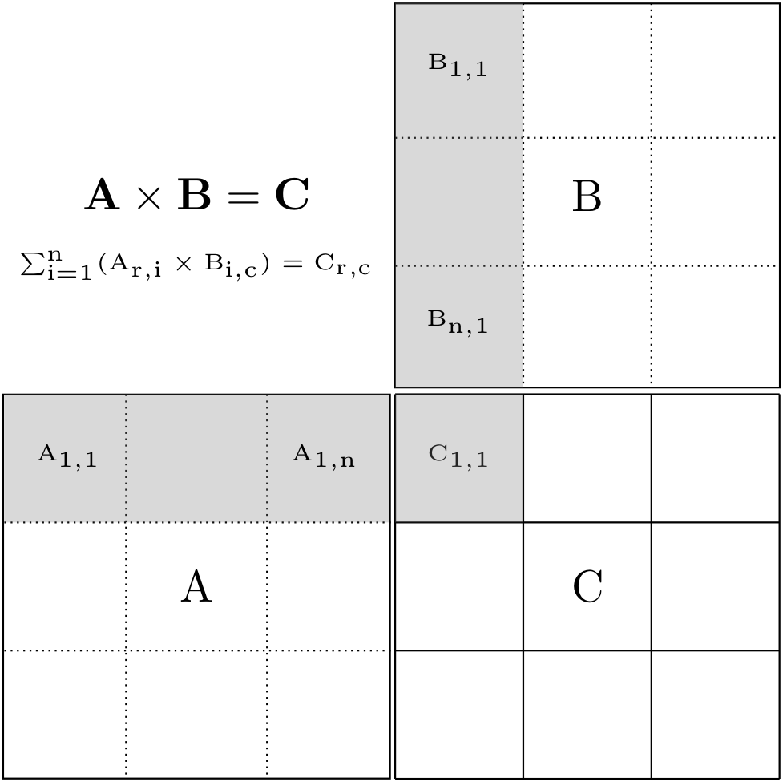
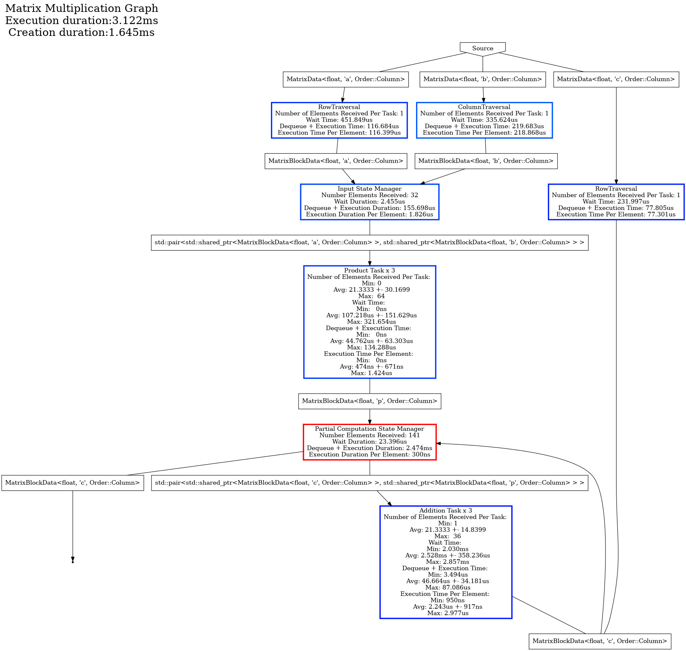

# Content
- [Goal](#goal)
- [Computation](#computation)
- [Data structure](#data-structure)
- [Task](#computation-task)
- [State and State Manager](#state-and-state-manager)
- [Graph](#graph)
- [Conclusion](#conclusion)

----

# Goal
This tutorial aims to create a BLAS-like Matrix Multiplication routine (C += A * B) to introduce how to resolve cycles in a Hedgehog graph.

Hedgehog graphs are allowed to have cycles. 
The problem is, whilst they are authorized, they need to be taken care of because if no extra care is used by a developer, the cyclic graphs will deadlock.
This is because by default, a node in Hedgehog can terminate if 1) there is no antecedent nodes (node connected and sending data to the node) alive and 2) there is no data in the input queues. 
When a cycle is built, the first condition is never met and the node never terminates. 
Therefore, the graph deadlocks. 
That is why we need to resolve cycles in the graph. This can be done by customizing the definition of the *canTerminate* function for one of the tasks in a cycle. 

In this tutorial, the [OpenBLAS](https://www.openblas.net/) library is required to do the computation. 

----

# Computation
The computation is a BLAS-like Matrix Multiplication routine (C += A * B) with:
* A, a (n * m) random matrix, 
* B, a (m * p) random matrix, 
* C, a (n * p) random matrix.

The computation steps are:
1. A traversal of matrices A, B, and C that produces blocks,
2. The creation of compatible pairs of blocks from A and B,
3. A partial matrix multiplication on the pair of blocks producing a new "temporary block",
4. The accumulation into the C blocks of the compatible temporary blocks,
5. Serve the output block when it is ready. 

Points 1, 3 and 4 will be represented as *tasks*. 

Points 2 and 5 will be represented as *states* and *state managers*, because it represents points where data needs to be gathered or stored temporally to satisfy dependencies. 

To create an output block it needs a full row of blocks from matrix A and a full column of blocks from matrix B, so two *tasks* will be implemented to traverse the matrices properly, as shown in the figure below.
 


----

# Data structure
The same data structure representing the matrix and the matrix blocks are reused from [tutorial 1]({{site.url}}/tutorials/tutorial1) and [tutorial 2]({{site.url}}/tutorials/tutorial2). 

The triplets are not used because we do not need to carry a block of A, B, and C, just a pair is used for the product. 

A special matrix block specialization with id as "p" is used for the temporary blocks (partial results). 

----

# Computation task
Here the tasks are simple:
* The product task is a call to the *sgemm* (single precision) or *dgemm* (double precision) routine from [OpenBLAS](http://www.openblas.net/),
* the addiction task, the sum of two contiguous pieces of memory.  

----

# State and State Manager
# States
Multiples "states" are defined in this algorithm:
* "InputBlockState": The state is used to create a pair of compatible blocks from matrices A and B. Because each of the blocks are used multiple time, these blocks maintain a "time to leave", which is defined at state construction. When the time to leave reaches 0, then the block is discarded from the temporary storage.

* "PartialComputationState": The state creates a pair of blocks from a compatible temporary block and block from matrix C. 

# State Manager 
We could have only used the *default state manager* for these states if there were no cycles in the graph.

But because of the cycle between the addition *task* and the partial computation *state*, a special *state manager* has to be defined from the "StateManager", and the "canTerminate" method has to be overloaded to resolve the cycle.

```cpp
template<class Type, Order Ord = Order::Row>
class PartialComputationStateManager
    : public hh::StateManager<
        2,
        MatrixBlockData<Type, 'c', Ord>, MatrixBlockData<Type, 'p', Ord>,
        std::pair<std::shared_ptr<MatrixBlockData<Type, 'c', Ord>>, std::shared_ptr<MatrixBlockData<Type, 'p', Ord>>>,
        MatrixBlockData<Type, 'c', Ord>
    > {
 public:
  explicit PartialComputationStateManager(std::shared_ptr<PartialComputationState<Type, Ord>> const &state) :
      hh::StateManager<
          2,
          MatrixBlockData<Type, 'c', Ord>, MatrixBlockData<Type, 'p', Ord>,
          std::pair<std::shared_ptr<MatrixBlockData<Type, 'c', Ord>>, std::shared_ptr<MatrixBlockData<Type, 'p', Ord>>>,
          MatrixBlockData<Type, 'c', Ord>
      >(state, "Partial Computation State Manager", false) {}

  [[nodiscard]] bool canTerminate() const override {
    this->state()->lock();
    auto ret = std::dynamic_pointer_cast<PartialComputationState<Type, Ord>>(this->state())->isDone();
    this->state()->unlock();
    return ret;
  }
};

template<class Type, Order Ord = Order::Row>
class PartialComputationState
    : public hh::AbstractState<
        2,
        MatrixBlockData<Type, 'c', Ord>, MatrixBlockData<Type, 'p', Ord>,
        std::pair<std::shared_ptr<MatrixBlockData<Type, 'c', Ord>>, std::shared_ptr<MatrixBlockData<Type, 'p', Ord>>>,
        MatrixBlockData<Type, 'c', Ord>
    > {
  //[...]
  bool isDone() { return ttl_ == 0; };
  //[...]
};
```

The *canTerminate* method overrides the default conditions to terminate the node: 1) there is no antecedent nodes (node connected and sending data to the node) alive and 2) there is no data in the input queues.
Now, the state managers terminate when the method *isDone* from the state it manages returns true, which corresponds to the end of the state computation.  

We can note that this state / state manager have 2 output types. 
When a pair is produced it is sent to the *Addition Task* for accumulation, and when a C block alone is produced it is sent as output of the graph. The C block is only outputted when it has been fully computed.

----

# Graph
Hedgehog presents and uses a directed graph. Which means, that cycles are possible and without special care will end in deadlock. 
This is because a node, by default, will terminate if these two conditions are true:
1: Are there no "input nodes" (nodes that send data to the considered nodes) alive ?
2: Are all the input data queues empty ?

Because of the cycle, it's possible there is no data in the input queues, but for each of them one of their "input nodes" may be alive.

To break the cycle, knowledge specific to the computation is needed to know when it's done, and this test is represented by overloading the "canTerminate" method.

Here is the final graph:


To deal with the multiple outputs of the *PartialComputationState* state, we have constructed the graph as follows:

```cpp
  matrixMultiplicationGraph.edges(stateManagerPartialComputation, additionTask);
  matrixMultiplicationGraph.outputs(stateManagerPartialComputation);
```
It reads, construct an edge between all valid common types between the *stateManagerPartialComputation* and *additionTask* nodes, and set the *stateManagerPartialComputation* node as output of the graph for all common types. 
In this case there is only one type between the *stateManagerPartialComputation* and the *additionTask* nodes (*std::pair<std::shared_ptr<MatrixBlockData<MatrixType, 'a', Ord>>, std::shared_ptr<MatrixBlockData<MatrixType, 'b', Ord>>>*) and there is only one type that can be used to produce output of the graph (*MatrixBlockData<MatrixType, 'c', Ord>*).
We could have written the graph construction as: 
```cpp
  matrixMultiplicationGraph.edge<std::pair<std::shared_ptr<MatrixBlockData<MatrixType, 'a', Ord>>, std::shared_ptr<MatrixBlockData<MatrixType, 'b', Ord>>>>(stateManagerPartialComputation, additionTask);
  matrixMultiplicationGraph.output<MatrixBlockData<MatrixType, 'c', Ord>>(stateManagerPartialComputation);
```
These API are useful if you want to make only specific connections between nodes even though they could have others.

----

# Conclusion
We have seen in this tutorial:
* How to manage a cycle in a graph,
* How to use multiple output types in a node.
