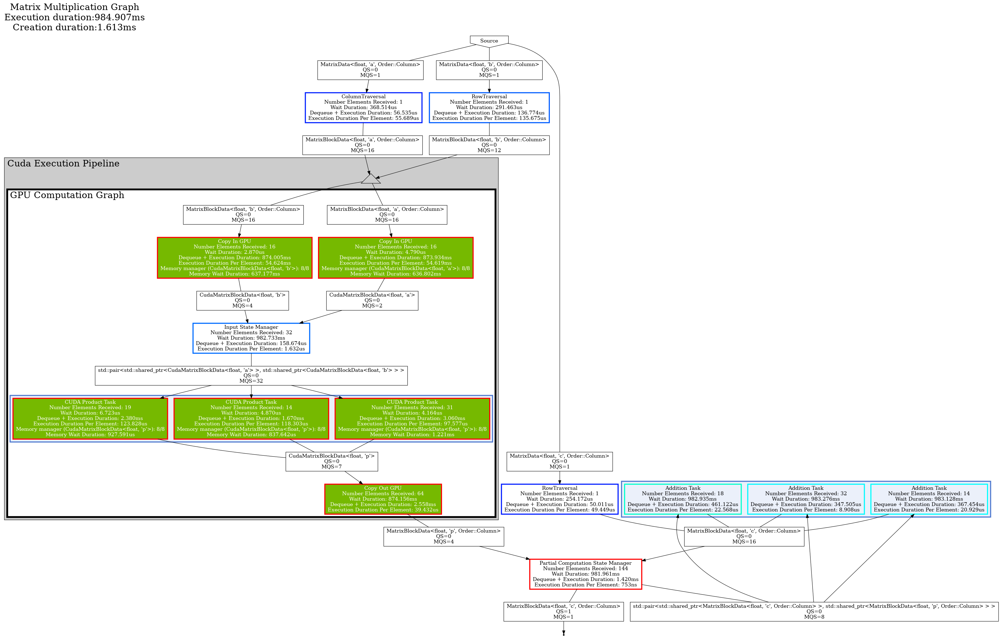

# Content
- [Goal](#goal)
- [Computation](#computation)
- [Graph as node](#graph-as-node)
- [Multi GPU Computation](#multi-gpu-computation)
- [Graph Representation](#graph-representation)
- [Conclusion](#conclusion)

----

# Goal
The goal of this tutorial is to demonstrate how to bundle a graph, and use it within an *execution pipeline* across multiple GPUs.

----

# Computation
The data structure, tasks, state, state manager and decomposition strategy are reused from [tutorial 5]({{site.url}}/tutorials/tutorial5). 
In *Hedgehog*, a graph is associated with a device. 
If no accelerator is used, the device id stored in the graph is not used. 
If an accelerator, such as a GPU, is used, *all* the tasks of a graph are associated to the same device; i.e., there is only 1 device Id per graph.

Because we want to split the computation into multiple GPUs we need:
* To create a graph per GPU, 
* To decompose the data and distribute it to the graphs. 

The decomposition strategy for this computation follows these rules:
1. Traversal for Matrix A is column-by-column, and matrix B is row-by-row, as shown in [tutorial 5]({{site.url}}/tutorials/tutorial5),
2. The matching columns of matrix A and rows of matrix B are sent to the same GPU in a round-robin way for multiple GPUs.

Example Matrix A:

| GPU / Column 	| 0 	| 1 	| 2 	| 3 	| 4 	| 5 	| 6 	|
|-------------	|---	|---	|---	|---	|---	|---	|---	|
| 0           	| x 	|   	|   	| x 	|   	|   	| x 	|
| 1           	|   	| x 	|   	|   	| x 	|   	|   	|
| 2           	|   	|   	| x 	|   	|   	| x 	|   	|

Example Matrix B:

| GPU / Row 	| 0 	| 1 	| 2 	| 3 	| 4 	| 5 	| 6 	|
|-------------	|---	|---	|---	|---	|---	|---	|---	|
| 0           	| x 	|   	|   	| x 	|   	|   	| x 	|
| 1           	|   	| x 	|   	|   	| x 	|   	|   	|
| 2           	|   	|   	| x 	|   	|   	| x 	|   	|

Therefore, all of column 0 for matrix A, and row 0 for matrix B will be sent to GPU 0. 
This strategy eliminates the need to communicate between GPUs as all the data is resident on the same GPU when multiplying the matrix blocks.

----

# Graph as node
A Hedgehog Graph is a node that can be added into any other graph just like other nodes, like a task.
This is useful when developing a general purpose graph for others to use or defining functionality specific to a device, such as CUDA GPUs.

In this tutorial, the "inside graph" holding all the "CUDA tasks" is created as follows:
```cpp
template<class MatrixType>
class CUDAComputationGraph : public hh::Graph<
    2,
    MatrixBlockData<MatrixType, 'a', Order::Column>, MatrixBlockData<MatrixType, 'b', Order::Column>,
    MatrixBlockData<MatrixType, 'p', Order::Column>
> {
 public:
  CUDAComputationGraph(size_t n, size_t m, size_t p, size_t blockSize, size_t numberThreadProduct) :
      hh::Graph<
          2,
          MatrixBlockData<MatrixType, 'a', Order::Column>, MatrixBlockData<MatrixType, 'b', Order::Column>,
          MatrixBlockData<MatrixType, 'p', Order::Column>
      >("GPU Computation Graph") {

    // Nodes creation
	auto copyInATask = std::make_shared<CudaCopyInGpu<MatrixType, 'a'>>(pBlocks, blockSize, n);
    auto copyInBTask = std::make_shared<CudaCopyInGpu<MatrixType, 'b'>>(nBlocks, blockSize, m);
    [...]

    // Graph Creation 
    this->inputs(copyInATask);
    this->inputs(copyInBTask);
    [...]
  }
};
```

A note, we do not need to create a specific class for the graph, we could use a graph instance directly.  

In main, the graph needs to be instantiated, and linked to other nodes.

It is not possible to modify a graph once it has been linked to another node. Once a graph has been inserted inside of another, then that graph is marked as inside and can no longer be modified or interacted with when using the Hedgehog API.
For example the following code would not compile:
```cpp
#include <hedgehog/hedgehog.h>

class ItoITask : public AbstractTask<1, int, int>{
 public:
  void execute(std::shared_ptr<int> ptr) override { this->addResult(ptr); }
};


int main (){
auto outerGraph = std::make_shared<Graph<int, int>>("Outer graph");
auto insideGraph = std::make_shared<Graph<int, int>>("Inside graph");

auto
  i1 = std::make_shared<ItoITask>(),
  i2 = std::make_shared<ItoITask>(),
  o1 = std::make_shared<ItoITask>(),
  o2 = std::make_shared<ItoITask>();

  insideGraph->inputs(i1);
  insideGraph->edges(i1, i2);

  outerGraph->inputs(o1);
  outerGraph->edges(o1, insideGraph);
  outerGraph->edges(insideGraph, o2);
  outerGraph->outputs(o2);

  // The graph is modified after it has been linked
  insideGraph->outputs(i2);
  
  outerGraph->executeGraph();
  outerGraph->pushData(std::make_shared<int>(1));
  outerGraph->finishPushingData();
  outerGraph->waitForTermination();
}
```

To correct it the call to "output" has to be moved:
```cpp
#include <hedgehog/hedgehog.h>

class ItoITask : public AbstractTask<int, int>{
 public:
  void execute(std::shared_ptr<int> ptr) override { this->addResult(ptr); }
};


int main (){
auto outerGraph = std::make_shared<Graph<int, int>>("Outer graph");
auto insideGraph = std::make_shared<Graph<int, int>>("Inside graph");

auto
  i1 = std::make_shared<ItoITask>(),
  i2 = std::make_shared<ItoITask>(),
  o1 = std::make_shared<ItoITask>(),
  o2 = std::make_shared<ItoITask>();

  insideGraph->inputs(i1);
  insideGraph->edges(i1, i2);
  insideGraph->outputs(i2);

  outerGraph->inputs(o1);
  outerGraph->edges(o1, insideGraph);
  outerGraph->edges(insideGraph, o2);
  outerGraph->outputs(o2);
  
  outerGraph->executeGraph();
  outerGraph->pushData(std::make_shared<int>(1));
  outerGraph->finishPushingData();
  outerGraph->waitForTermination();
}
```

----

# Multi GPU Computation
To execute across multi-GPUs, *Hedgehog* has a specialized node called an *Execution Pipeline*. 
It will:
* Duplicate the graph and associate each of them to a specific device Id, 
* Distribute data over the graphs.

So, to create an *Execution Pipeline*, it needs: 
* The number of times the graph is to be duplicated, 
* The device ids the graphs will be associated with, 
* An overload of the "sendToGraph" method, that define the way the data is distributed to the graphs (one for each input type). 

```cpp
template<class MatrixType>
class MultiGPUExecPipeline : public hh::AbstractExecutionPipeline<
    2,
    MatrixBlockData<MatrixType, 'a', Order::Column>,
    MatrixBlockData<MatrixType, 'b', Order::Column>,
    MatrixBlockData<MatrixType, 'p', Order::Column>
> {
 private:
  size_t numberGraphDuplication_ = 0;

 public:
  MultiGPUExecPipeline(std::shared_ptr<hh::Graph<
      2,
      MatrixBlockData<MatrixType, 'a', Order::Column>, MatrixBlockData<MatrixType, 'b', Order::Column>,
      MatrixBlockData<MatrixType, 'p', Order::Column>
  >> const &graph, std::vector<int> const &deviceIds)
      : hh::AbstractExecutionPipeline<
      2,
      MatrixBlockData<MatrixType, 'a', Order::Column>, MatrixBlockData<MatrixType, 'b', Order::Column>,
      MatrixBlockData<MatrixType, 'p', Order::Column>
  >(graph, deviceIds, "Cuda Execution Pipeline"), numberGraphDuplication_(deviceIds.size()) {}
  virtual ~MultiGPUExecPipeline() = default;

  bool sendToGraph(
      std::shared_ptr<MatrixBlockData<MatrixType, 'a', Order::Column>> &data,
      size_t const &graphId) override {
    return data->colIdx() % numberGraphDuplication_ == graphId;
  }

  bool sendToGraph(
      std::shared_ptr<MatrixBlockData<MatrixType, 'b', Order::Column>> &data,
      size_t const &graphId) override {
    return data->rowIdx() % numberGraphDuplication_ == graphId;
  }
};
```

The *execution pipeline* is also used like any other nodes in *Hedgehog*, it has to be instantiated and added into a graph. 
```cpp
  // GPU Graph
  auto cudaMatrixMultiplication = std::make_shared<CUDAComputationGraph<MatrixType>>(n, m, p, blockSize, numberThreadProduct);

  // Execution Pipeline
  auto executionPipeline = std::make_shared<MultiGPUExecPipeline<MatrixType>>(cudaMatrixMultiplication, deviceIds);

  // Send the blocks to GPU Graph
  matrixMultiplicationGraph.edges(taskTraversalA, executionPipeline);
  matrixMultiplicationGraph.edges(taskTraversalB, executionPipeline);

  // Get back the blocks out the GPU Graph
  matrixMultiplicationGraph.edges(executionPipeline, stateManagerPartialComputation);
```

----

# Graph Representation
Here is the final graph:


----

# Conclusion
We have seen in this tutorial:
* How to bundle a task into a reusable or shareable graph, 
* How to manage computation into multiple GPUs with the *Execution Pipeline*. 
