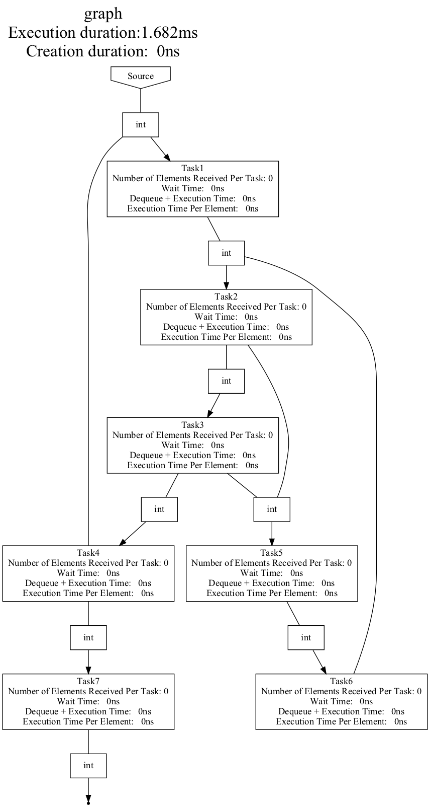

# Content
- [Context](#context)
- [Logic](#logic)
- [API](#api)
  - [Graph representation](#graph-representation)
  - [Tests at compile time](#tests-at-compile-time)
  - [Usage of tests](#usage-of-tests)
- [Conclusion](#conclusion)

----

# Context

In the previous tutorials, we present Hedgehog and its runtime library. 
Built-in to Hedgehog, there are transparent compile-time analysis that takes place to ensure that all connections (input/output nodes of a graph and edges) are valid.

In addition to that, we have added a tool library that can be used to control the graph structure at compile-time. 

In order to do as much computation as possible at compile-time we have developed this library around the modifier *constexpr*. 
In essence, it indicates to the compiler that this code *can* be executed at compile-time.

This modifier has been added to the c++ 11 norm and enriched since then. 
The latest additions are important for the library (constexpr std::vector and constexpr std::string).
That is why only the newest compilers that support these features can be used, for example g++ 12.1.

---

# Logic

The library is generally used by using the following three steps:
1) Create the representation of the compilation at compile time, 
2) Run the tests over the graph representation,
3) Show the errors found or transform the graph representation to the runtime graph. 

We need this compile-time representation in addition to the runtime graph because the graph can't be represented at compile-time. 
This is a limitation of the language, for example the std::shared_ptr can not be used at compile-time. 

The API used at compile-time has been designed to mimic the runtime one and has been enriched to query the graph structure. 

---

# API

## Graph representation 

In order to build the graph representation, we follow the same logic as the runtime library. 
First, the nodes and the graph representation need to be instantiated, and second, the graph representation can be built.

For example if we want to represent this task and graph:
```cpp
class TaskIntInt : public hh::AbstractTask<1, int, int> {
 public:
  void execute(std::shared_ptr<int> data) override { this->addResult(data); }
};

class GraphIntInt : public hh::Graph<1, int, int> {
 public:
  explicit GraphIntInt(std::string const &name) : hh::Graph<1, int, int>(name) {}
};
```

to build this graph: 



We declare the compile-time representation as: 

```cpp
hh_cx::Node<TaskIntInt> node1("node1"),
hh_cx::Graph<GraphIntInt> graph{"graph"};
```

The first template parameter of a *hh_cx::Node* and the template parameter of a *hh_cx::Graph* is the type these nodes represent at compile-time.
The rest of the template parameters of the *hh_cx::Node* are discussed later. 

A state-manager, an internal graph, or an execution pipeline are also represented with a *hh_cx::Node* at compile-time. 
In the case of an internal graph, it is considered as a black box, a single node, only the input and output types and its connections matters and are represented at compile-time. 

The nodes are created with an identifier ("node1" in the example). 
This identifier needs to be unique and is used later on to do the mapping between the compile-time representation and the runtime node. 

Once the nodes are instantiated, we can build the graph representation with an API like the runtime one:

```cpp
hh_cx::Node<TaskIntInt>
  node1("node1"), node2("node2"), node3("node3"),
  node4("node4"), node5("node5"), node6("node6"),
  node7("node7");

hh_cx::Graph<GraphIntInt> graph{"graph"};

graph.inputs(node1);
graph.edges(node1, node2);
graph.edges(node2, node3);
graph.edges(node2, node5);
graph.edges(node3, node4);
graph.edges(node3, node5);
graph.edges(node4, node1);
graph.edges(node4, node7);
graph.edges(node5, node6);
graph.edges(node6, node2);
graph.outputs(node7);
```

Once the graph is built, we can associate it to test:
```cpp
auto dataRaceTest = hh_cx::DataRaceTest < GraphIntInt > {};
auto cycleTest = hh_cx::CycleTest < GraphIntInt > {};
graph.addTest(&dataRaceTest);
graph.addTest(&cycleTest);
```

Details about tests are given in a later section.

This graph creation needs to be wrapped in a constexpr function (callable) to be used by the library as shown bellow: 
```cpp
constexpr auto constructGraphInts() {
  hh_cx::Node<TaskIntInt>
      node1("node1"), node2("node2"), node3("node3"),
      node4("node4"), node5("node5"), node6("node6"),
      node7("node7");

  hh_cx::Graph<GraphIntInt> graph{"graph"};

  graph.inputs(node1);
  graph.edges(node1, node2);
  graph.edges(node2, node3);
  graph.edges(node2, node5);
  graph.edges(node3, node4);
  graph.edges(node3, node5);
  graph.edges(node4, node1);
  graph.edges(node4, node7);
  graph.edges(node5, node6);
  graph.edges(node6, node2);
  graph.outputs(node7);

  auto dataRaceTest = hh_cx::DataRaceTest < GraphIntInt > {};
  auto cycleTest = hh_cx::CycleTest < GraphIntInt > {};
  graph.addTest(&dataRaceTest);
  graph.addTest(&cycleTest);
  return graph;
}
```

## Tests at compile-time

The goal of this tool library is to test a graph structure at compile time. 
We have built an abstraction to define the tests (*hh_cx::AbstractTest*). 
This abstraction has been used to define the two tests available in the library; the cycle detection test and the data race test.

### Cycle detection test

Cycles are authorised in Hedgehog but needs extra care (cf. [Tutorial 4]({{site.url}}/tutorials/tutorial4)).
This test is meant to detect cycles with the Tarjan and Johnson algorithms.
Once these cycles are detected, they are filtered to only present the cycles in which no nodes have implemented the *canTerminate* method.

**This test only detect the presence of the method in one of the nodes, but not the validity of the condition in it !**
This is only meant to determine if the end-user has not forgotten to take care of it. 

In the previous example there are cycles between the nodes:
- node1 -> node2 -> node3 -> node4 -> node1
- node2 -> node3 -> node5 -> node6 -> node2
- node2 -> node5 -> node6 -> node2

And once the test runs it detects them and returns (we cover later how we produce this output): 

```
Cycles found, the canTerminate() method needs to be defined for each of these cycles.
	node1 -> node2 -> node3 -> node4 -> node1
	node2 -> node3 -> node5 -> node6 -> node2
	node2 -> node5 -> node6 -> node2
```


If we change the definition of the task to:
```cpp
class TaskIntInt : public hh::AbstractTask<1, int, int> {
 public:
  explicit TaskIntInt(std::string const & name) : hh::AbstractTask<1, int, int>(name){}
  void execute(std::shared_ptr<int> data) override { this->addResult(data); }
  bool canTerminate() const override{ return false; }
};
```

This solves the problem for the test, the graph is considered as valid while it is not at runtime: the task never terminates.

### Data race test

This test is meant to detect data races that can occur if a non-const piece of data is sent to more than one node.
For memory, when a piece of data is sent via an *addResult*, the *shared_ptr* wrapping it is copied to each of the successors. 

In the example we have multiple potential data races:
- node2 -> node3 / node5 for the int type
- node3 -> node5 / node4 for the int type
- node4 -> node1 / node7 for the int type

They are found by the test: 
```
Possible data races found:
	node2 -> node3 (int)
	node2 -> node5 (int)
	node3 -> node5 (int)
	node3 -> node4 (int)
	node4 -> node1 (int)
	node4 -> node7 (int)
```

If we were to not transfer *int* but *int const* such as: 

```cpp

class TaskCIntCInt : public hh::AbstractTask<1, int const, int const> {
public:
explicit TaskCIntCInt(std::string const &name) : hh::AbstractTask<1, int const, int const>(name) {}
void execute(std::shared_ptr<int const> data) override { this->addResult(data); }
};

class GraphCIntCInt : public hh::Graph<1, int const, int const> {
public:
explicit GraphCIntCInt(std::string const &name) : hh::Graph<1, int const, int const>(name) {}
};

constexpr auto constructGraphConstInts() {
  hh_cx::Node<TaskCIntCInt>
      node1("node1"), node2("node2"), node3("node3"),
      node4("node4"), node5("node5"), node6("node6"),
      node7("node7");

  hh_cx::Graph<GraphCIntCInt> graph{"graph"};

  graph.inputs(node1);
  graph.edges(node1, node2);
  graph.edges(node2, node3);
  graph.edges(node2, node5);
  graph.edges(node3, node4);
  graph.edges(node3, node5);
  graph.edges(node4, node1);
  graph.edges(node4, node7);
  graph.edges(node5, node6);
  graph.edges(node6, node2);
  graph.outputs(node7);

  auto dataRaceTest = hh_cx::DataRaceTest < GraphCIntCInt > {};
  auto cycleTest = hh_cx::CycleTest < GraphCIntCInt > {};
  graph.addTest(&dataRaceTest);
  graph.addTest(&cycleTest);
  return graph;
}
```

There is no problem found by the test anymore because the values (here *int*) are not mutable.

Finally, it is possible to declare [a] input type[s] as read-only. 
We have added this feature to represent a node that receives a non-const data with a kernel that does not write the received value. 
The read-only input types are declared on the template parameters of the nodes. 

In our example, we can declare the *int* input node as follows:
```cpp
hh_cx::Node<TaskIntInt, int>
  node1("node1"), node2("node2"), node3("node3"),
  node4("node4"), node5("node5"), node6("node6"),
  node7("node7");
```

With this declaration, no problem is found by the test. 

### User-defined test

It is possible to add your own test. 
A test is created by implementing the *hh_cx::AbstractTest* abstraction. 

For example, we can create a test that will print the critical path of a graph.
In order to do so, we need to have some kind of representation of the weight of the nodes. 

To add metadata to the nodes for the static analysis we have created the *hh_cx::PropertyMap*. 
Its template parameter is the type of metadata it holds. 
It maps the node identifier to the metadata : 
```cpp
  hh_cx::PropertyMap<double> propertyMap;
  propertyMap.insert("node1", 1);
  propertyMap.insert("node2", 2);
  propertyMap.insert("node3", 3);
  propertyMap.insert("node4", 4);
  propertyMap.insert("node5", 5);
  propertyMap.insert("node6", 6);
  propertyMap.insert("node7", 12);
```

Once we have associated these metadata we can reuse the test in our tests. 
The *hh_cx::AbstractTest* abstraction needs the test name at construction and needs the *void test(hh_cx::Graph<GraphType> const \*graph)* method implemented.
In it the *graphValid* setter is used to set the graph's validity and *appendErrorMessage* is used to create the report. 

The test can be written as: 

```cpp
template<class GraphType>
class TestCriticalPath : public hh_cx::AbstractTest<GraphType> {
 private:
  double_t
      maxPathValue_ = 0,
      currentPathValue_ = 0;

  hh_cx::PropertyMap<double>
      propertyMap_;

  hh_cx::Graph<GraphType> const
      *graph_ = nullptr;

  std::vector<hh_cx::behavior::AbstractNode const *>
      criticalVector_{},
      visited_{};

 public:
  constexpr explicit TestCriticalPath(hh_cx::PropertyMap<double> propertyMap)
      : hh_cx::AbstractTest<GraphType>("Critical Path"), propertyMap_(std::move(propertyMap)) {}

  constexpr ~TestCriticalPath() override = default;

  constexpr void test(hh_cx::Graph<GraphType> const *graph) override {
    graph_ = graph;

    auto const &inputNodeMap = graph->inputNodes();
    for (auto const &type : inputNodeMap.types()) {
      for (auto const &inputNode : inputNodeMap.nodes(type)) {
        this->visitNode(inputNode);
      }
    }

    if (criticalVector_.empty()) {
      this->graphValid(true);
    } else {
      this->graphValid(false);

      this->graphValid("The critical path is:\n\t");
      this->appendErrorMessage(criticalVector_.front()->name());

      for (size_t criticalNodeId = 1; criticalNodeId < criticalVector_.size(); ++criticalNodeId) {
        this->appendErrorMessage(" -> ");
        this->appendErrorMessage(criticalVector_.at(criticalNodeId)->name());
      }
    };
  }

 private:
  constexpr void visitNode(hh_cx::behavior::AbstractNode const *node) {
    if (std::find(visited_.cbegin(), visited_.cend(), node) == visited_.cend()) {
      currentPathValue_ += propertyMap_.property(node->name());
      visited_.push_back(node);

      if (std::find(visited_.cbegin(), visited_.cend(), node) != visited_.cend()) {
        if (currentPathValue_ > maxPathValue_) {
          maxPathValue_ = currentPathValue_;
          criticalVector_.clear();
          criticalVector_ = visited_;
        }
      }

      for (auto const &neighbor : graph_->adjacentNodes(node)) { visitNode(neighbor); }

      currentPathValue_ -= propertyMap_.property(node->name());
      visited_.pop_back();
    }
  }
};
```

The graph construction is: 
```cpp
constexpr auto constructGraphIntCustomTest() {
  hh_cx::Node<TaskIntInt>
      node1("node1"),
      node2("node2"),
      node3("node3"),
      node4("node4"),
      node5("node5"),
      node6("node6"),
      node7("node7");

  hh_cx::Graph<GraphIntInt> graph{"Custom test graph"};

  graph.inputs(node1);
  graph.edges(node1, node2);
  graph.edges(node2, node3);
  graph.edges(node2, node5);
  graph.edges(node3, node4);
  graph.edges(node3, node5);
  graph.edges(node4, node1);
  graph.edges(node4, node7);
  graph.edges(node5, node6);
  graph.edges(node6, node2);
  graph.outputs(node7);

  hh_cx::PropertyMap<double> propertyMap;
  
  propertyMap.insert("node1", 1);
  propertyMap.insert("node2", 2);
  propertyMap.insert("node3", 3);
  propertyMap.insert("node4", 4);
  propertyMap.insert("node5", 5);
  propertyMap.insert("node6", 6);
  propertyMap.insert("node7", 12);

  auto criticalPathTest = TestCriticalPath<GraphIntInt>(propertyMap);
  graph.addTest(&criticalPathTest);
  return graph;
}
```

and produce:  

```
Custom test graph is Valid ? false-> The critical path is:
	node1 -> node2 -> node3 -> node4 -> node7
```

## Usage of tests

### Run the tests - Defroster creation

To run the tests, we need to create a defroster.
The defroster is the data structure that is made to transfer the data from compile-time to runtime.
It also applies the tests on the graph and extracts the graph's structure that will be used later on. 

To create a defroster a user can use the  *hh_cx::createDefroster* function as follows:
```cpp
  constexpr auto defrosterInt = hh_cx::createDefroster<&constructGraphInt>();
  constexpr auto defrosterCanTerminate = hh_cx::createDefroster<&constructGraphWithCanTerminate>();
  constexpr auto defrosterROInt = hh_cx::createDefroster<&constructGraphROInt>();
  constexpr auto defrosterConstInt = hh_cx::createDefroster<&constructGraphConstInt>();
  constexpr auto defrosterCustomTest = hh_cx::createDefroster<&constructGraphIntCustomTest>();
```

### Usage of defroster

The *defroster* can be used at compile time to either stop the compilation with a *std::static_assert* if the graph is not valid: 
```cpp
  static_assert(!defrosterInt.isValid(), "The graph should not be valid");
// or
  static_assert(!defrosterCustomTest.isValid(), "The graph should not be valid");
```
or branch the compilation of some code with an *if constexpr*:
```cpp
  if constexpr (defrosterCanTerminate.isValid()) {
    std::cout << "The graph with the canTerminate method defined is valid" << std::endl;
  }else {
    std::cout << "The graph with the canTerminate method defined is not valid" << std::endl;
  }
```

A real use case could be to print the report if the graph is not valid: 

```cpp
  if constexpr (!defrosterInt.isValid()) { std::cout << defrosterInt.report()  << std::endl; }
  else { /*[...]*/ }
```

If the graph is valid, we can transform the compile-time representation to a runtime graph. 
To do so, we need to instantiate the runtime node and map them to the compile-time graph's nodes representation: 
```cpp
  if constexpr (!defrosterROInt.isValid()) {
    std::cout << defrosterROInt.report() << std::endl;
  } else {
    auto graph = defrosterROInt.map(
      "node1", std::make_shared<TaskIntInt>("Task1"),
      "node2", std::make_shared<TaskIntInt>("Task2"),
      "node3", std::make_shared<TaskIntInt>("Task3"),
      "node4", std::make_shared<TaskIntInt>("Task4"),
      "node5", std::make_shared<TaskIntInt>("Task5"),
      "node6", std::make_shared<TaskIntInt>("Task6"),
      "node7", std::make_shared<TaskIntInt>("Task7")
  );
  graph->createDotFile("GraphIntInt.dot");
}
```

The dot file created is the same as the one presented in [this previous section](#graph-representation).
The *graph* object can then be used as a runtime graph. 

---

# Conclusion

In this tutorial we have seen how to: 
- represent a graph at compile-time, 
- run test[s] on it,
- use the test[s] results, 
- create a runtime graph from the compile-time structure representation.
