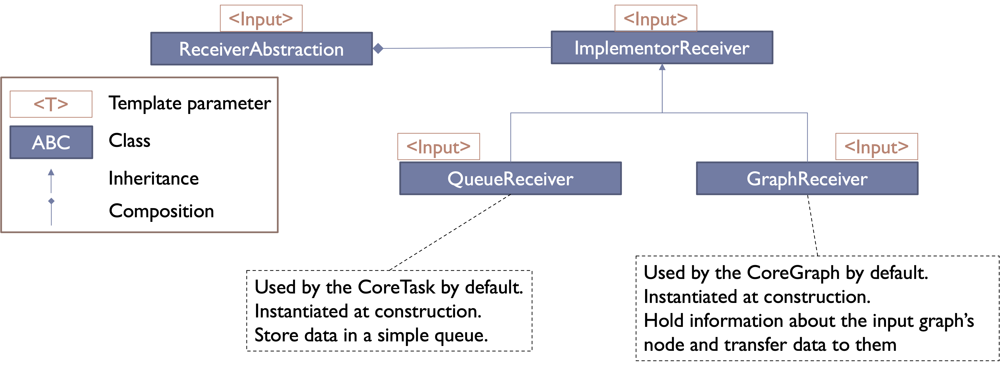

# Content

- [Context](#context)
- [Architecture](#architecture)
- [Creating a new node by deriving the API](#creating-a-new-node-by-deriving-the-api)
- [Creating a new type of node (advanced users)](#creating-a-new-type-of-node-advanced-users)
- [Conclusion](#conclusion)

---

# Context

Hedgehog has been meant to be fairly easy to extend depending on different types of needs.
There are 3 main extension points with increasing levels of complexity:

- Deriving from our API nodes to create your own nodes that shares the base logic with an existing node,
- Creating a new implementation for our core's abstractions if you want to change the abstractions behaviors,
- Creating a new node/core if you need a Hedgehog node that does not work as the one already implemented.

To showcase and explain these extension points we need to first present the Hedgehog architecture.

---

# Architecture

Hedgehog is decomposed into three main parts:

- the API (namespace hh) defines the high-level objects used by most end-users,
- the behavior (namespace hh::behavior) defines the shared methods existing in the API objects,
- the cores (namespace hh::core) is the place where the low-level functionality is implemented.

The main idea was to make a simple-to-use library by only exposing what is useful to most users.
For example, most users do not need to manipulate each of the mutexes in the library.
And that explains the dichotomy between the API and the cores.
Furthermore, most IDEs can present the methods that can/need to be defined to create objects.
In order to limit this list we need to "hide" the less useful methods, hence the separation between the API and the
core.

The behavior classes define the methods that are shared amongst different API classes.
These behaviors are not meant to be used as is, that is why they are hidden in a specific namespace to not expose them
to most users.

In terms of design patterns:

- The logic relationship between the nodes and the graph is a [*composite* structural design pattern](http://www.goprod.bouhours.net/?page=pattern&pat_id=7).
- The relationship between the API and the behavior classes are following a [*template method* behavioral design patterns](http://www.goprod.bouhours.net/?page=pattern&pat_id=22).
- The core is designed to follow a *template method* behavioral design pattern and the [*bridge* structural design pattern]("http://www.goprod.bouhours.net/?page=pattern&pat_id=3).

We present these patterns in the following sections and different methodologies for how to extend the libary.

---

# Creating a new node by deriving the API

This type of extension is made to create a type of node that follows the same logic of an existing node.
For example, in [preamble]({{site.url}}/tutorials/preamble#task-logic) we have presented the logic of an *AbstractTask*.

This logic remains for the CUDA tasks, which is why to create the *hh::AbstractCUDATask* we simply derived from *hh::
AbstractTask*:

```cpp
template<size_t Separator, class ...AllTypes>
class AbstractCUDATask : public AbstractTask<Separator, AllTypes...>;
```

Another example is the work of Jane Liu, a student that worked at NIST during the Summer Undergraduate Research Fellowship, who implemented real-time capabilities into the library by creating an abstract priority task.

To do so, she has chosen to create the following:

```cpp
#include <pthread.h>
#include <sched.h>
#include "hedgehog/hedgehog.h"

namespace hh {
enum class Policy {SchedFIFO = SCHED_FIFO, SchedRR = SCHED_RR, SchedOther = SCHED_OTHER};

template<size_t Separator, class ...AllTypes>
class AbstractPriorityTask : public hh::AbstractTask<Separator, AllTypes ...> {
  private:
    Policy policy_;
    const struct sched_param *param_;

  public:
    AbstractPriorityTask(std::string const &name, size_t numberThreads, Policy policy, const sched_param *param) :
    hh::AbstractTask<Separator, AllTypes ...>(name, numberThreads), policy_(policy), param_(param) {}
    
    AbstractPriorityTask(Policy policy, const sched_param *param)
    : hh::AbstractPriorityTask<Separator, AllTypes ...>("AbstractPriorityTask", 1, policy, param) {}
    
    AbstractPriorityTask(std::string const &name, Policy policy, const sched_param *param)
    : hh::AbstractPriorityTask<Separator, AllTypes ...>(name, 1, policy, param) {}
    
    AbstractPriorityTask(
        std::shared_ptr<core::CoreTask<Separator, AllTypes ...>> taskCore, Policy policy, const sched_param *param)
    : hh::AbstractTask<Separator, AllTypes ...>(taskCore), policy_(policy), param_(param) {}
    
    ~AbstractPriorityTask() = default;
    
    [[nodiscard]] Policy policy() const { return policy_; }
    [[nodiscard]] sched_param const *param() const { return param_; }
    
    virtual void initialize() {
        int int_policy = (int) policy_;
        if (pthread_setschedparam(pthread_self(), int_policy, param_)) {
          std::cerr << "Failed to set thread scheduling: " << std::strerror(errno) << std::endl;
        }
    }
};

}
```
This task abstraction is only usable if *pthread* is accessible. It uses the *initialize* method to set the real-time properties of this task for this thread.

---

# Modifying a node by changing its core's abstraction implementor


As we have mentioned before, the cores are built by using the *bridge* structural pattern.

If we look at the class diagram of the node's abstraction for receiving data , it looks like this: 




The *CoreTask* and the *CoreGraph* inherits both from the *ReceiverAbstraction* but uses different implementors: *QueueReceiver* and *GraphReceiver* respectively.


Here is a list of other abstractions that follows this bridge patterns:

- *ReceiverAbstraction* to receive data,
- *SenderAbstraction* to send data,
- *NotifierAbstraction* to notify successor nodes that a data is present,
- *SlotAbstraction* to accept the message sent by the notifier,
- *ExecuteAbstraction* to present how the data are processed by the node.

We can use these different bridges to customize the implementation of this abstraction. 

For example, if we want to use a priority queue instead of a normal queue we can customize the implementation of the receiver: 
```cpp
template<class Input>
class PriorityQueueReceiver : public hh::core::implementor::ImplementorReceiver<Input> {
 private:
  std::unique_ptr<std::priority_queue<std::shared_ptr<Input>>> const
      queue_ = nullptr; ///< Queue storing to be processed data

  std::unique_ptr<std::set<hh::core::abstraction::SenderAbstraction<Input> *>> const
      senders_ = nullptr; ///< List of senders attached to this receiver

  size_t
      maxSize_ = 0; ///< Maximum size attained by the queue

 public:
  explicit PriorityQueueReceiver()
      : queue_(std::make_unique<std::priority_queue<std::shared_ptr<Input>>>()),
        senders_(std::make_unique<std::set<hh::core::abstraction::SenderAbstraction<Input> *>>()) {}
  virtual ~PriorityQueueReceiver() = default;
  void receive(std::shared_ptr<Input> const data) final {
    queue_->push(data);
    maxSize_ = std::max(queue_->size(), maxSize_);
  }
  [[nodiscard]] std::shared_ptr<Input> getInputData() override {
    assert(!queue_->empty());
    auto front = queue_->top();
    queue_->pop();
    return front;
  }
  [[nodiscard]] size_t numberElementsReceived() const override { return queue_->size(); }
  [[nodiscard]] size_t maxNumberElementsReceived() const override { return maxSize_; }
  [[nodiscard]] bool empty() const override { return queue_->empty(); }
  [[nodiscard]] std::set<hh::core::abstraction::SenderAbstraction<Input> *> const &connectedSenders() const override {
    return *senders_;
  }
  void addSender(hh::core::abstraction::SenderAbstraction<Input> *const sender) override { senders_->insert(sender); }
  void removeSender(hh::core::abstraction::SenderAbstraction<Input> *const sender) override { senders_->erase(sender); }
};

template<class ...Inputs>
class MultiPriorityQueueReceivers : public PriorityQueueReceiver<Inputs> ... {
 public:
  explicit MultiPriorityQueueReceivers() : PriorityQueueReceiver<Inputs>()... {}
  ~MultiPriorityQueueReceivers() override = default;
};
```

The definition of a *MultiPriorityQueueReceivers* is made to manage all input types from a node. 

If we want to have a customizable abstraction we need to automatically deduce the type of *MultiPriorityQueueReceivers* from the template arguments of a task. 
To do so we need to create a trait and a helper to do the conversion automatically: 
```cpp
template<class Inputs>
struct MultiPriorityQueueReceiversTypeDeducer;

template<class ...Inputs>
struct MultiPriorityQueueReceiversTypeDeducer<std::tuple<Inputs...>> {
  using type = MultiPriorityQueueReceivers<Inputs...>;
};

template<class TupleInputs>
using MultiPriorityQueueReceiversTypeDeducer_t = typename MultiPriorityQueueReceiversTypeDeducer<TupleInputs>::type;

template<size_t Separator, class ...AllTypes>
using MPQR = MultiPriorityQueueReceiversTypeDeducer_t<hh::tool::Inputs<Separator, AllTypes...>>;
```

It can then be used to create an abstraction to create a task that uses a priority queue instead of a normal queue: 
```cpp
template<size_t Separator, class ...AllTypes>
class AbstractPriorityQueueTask : public hh::AbstractTask<Separator, AllTypes...> {
  public:
    explicit AbstractPriorityQueueTask(std::string const &name, size_t const numberThreads, bool const automaticStart)
      : hh::AbstractTask<Separator, AllTypes...>(
          std::make_shared<hh::core::CoreTask<Separator, AllTypes...>>(
            this,
            name, numberThreads, automaticStart,
            std::make_shared<hh::core::implementor::DefaultSlot>(),
            std::make_shared<MPQR<Separator, AllTypes...>>(),
            std::make_shared<hh::tool::DME<Separator, AllTypes...>>(this),
            std::make_shared<hh::core::implementor::DefaultNotifier>(),
            std::make_shared<hh::tool::MDS<Separator, AllTypes...>>()
          )
        ) {}
};
```
Thanks to the helper we have just defined we can deduct the right type from the template parameters of the *AbstractPriorityQueueTask*.

Then, like any other task we define a conreate one: 
```cpp
class IntIntPriorityQueueTask : public AbstractPriorityQueueTask<1, int, int> {
 public:
  IntIntPriorityQueueTask() : AbstractPriorityQueueTask("IntPriorityQueue", 1, false) {}
  void execute(std::shared_ptr<int> data) override {
    std::cout << *data << std::endl;
    this->addResult(data);
  }
};
```

We can do exactly the same to define a state manager that uses a priority queue: 
```cpp
template<size_t Separator, class ...AllTypes>
class PriorityQueueStateManager : public hh::StateManager<Separator, AllTypes...> {
 public:
  explicit PriorityQueueStateManager(std::shared_ptr<hh::AbstractState<Separator, AllTypes...>> const &state,
                                     std::string const &name, bool const automaticStart)
      : hh::StateManager<Separator, AllTypes...>(
      std::make_shared<hh::core::CoreStateManager<Separator, AllTypes...>>(
          this,
          state, name, automaticStart,
          std::make_shared<hh::core::implementor::DefaultSlot>(),
          std::make_shared<MPQR<Separator, AllTypes...>>(),
          std::make_shared<hh::tool::DME<Separator, AllTypes...>>(state.get()),
          std::make_shared<hh::core::implementor::DefaultNotifier>(),
          std::make_shared<hh::tool::MDS<Separator, AllTypes...>>()
      ), state
  ) {}
};

// And a compatible state: 
class IntState : public hh::AbstractState<1, int, int> {
 public:
  void execute(std::shared_ptr<int> data) override {
    std::cout << *data << std::endl;
    this->addResult(data);
  }
};
```

Then finally we can create graphs using these new tasks: 
```cpp
  hh::Graph<1, int, int> g;
//  auto task = std::make_shared<IntIntPriorityQueueTask>();
//  g.inputs(task);
//  g.outputs(task);

  auto sm =
      std::make_shared<PriorityQueueStateManager<1, int, int>>(
        std::make_shared<IntState>(),
        "Priority State Manager",
        false);

  g.inputs(sm);
  g.outputs(sm);

  for (int i = 100; i >= 0; --i) { g.pushData(std::make_shared<int>(i)); }

  g.executeGraph();
  g.finishPushingData();
  g.waitForTermination();
```

And even though we push ints from 100 to 0, they are printed from the state manager / task from 0 to 100 proving the correct usage of the priority queue. 

---
# Creating a new type of node (advanced users)

If the existing nodes do not meet the functionality that you are looking for, then it is possible to create new nodes. 
To create a new node, we need to create 1) a core and 2) create the corresponding API. 

Both of the API and the core are built following the *template method* behavioral pattern.
To create a new core and API it suffices to create your classes by inheriting from the different abstractions:
- For the core:
  - NodeAbstraction: Base node definition
  - GraphNodeAbstraction: Base graph definition
  - TaskNodeAbstraction: Base task definition
  - ExecutionPipelineNodeAbstraction:Base Execution pipeline definition
  - NotifierAbstraction: Sending message notification abstraction
  - SlotAbstraction: Receiving message notification abstraction
  - ReceiverAbstraction: Receiving data abstraction
  - SenderAbstraction: Sending data abstraction
  - ClonableAbstraction: Clonable abstraction for duplicating a node when creating clone graph in an execution pipeline
  - GroupableAbstraction: Groupable abstraction to duplicate a node to form a group
  - CanTerminateAbstraction: Interface for calling API nodes that can redefine the canTerminate method
  - CleanableAbstraction: Interface for calling API nodes that can redefine the clean method
  - CopyableAbstraction: Interface for calling API nodes that can redefine the copy method
  - ExecutionAbstraction: Interface for calling API nodes that can redefine the execute method
- For the API: 
  - MultiReceivers: Allows for a node to have the info to receive multiple types of data
  - MultiSenders: Allows for a node to have the info to send multiple types of data
  - CanTerminate: Defines the canTerminate method
  - Cleanable: Defines the clean method
  - Copyable: Defines the copy method
  - Execute: Defines the execute method for a type
  - MultiExecute: Defines the execute method for multiple types
  - Node: Defines the base information for a node
  - TaskNode: Defines the base information for a task

We have also created interfaces to manage the input data and the output data of the cores independently:
- ExecutionPipelineInputsManagementAbstraction
- ExecutionPipelineOutputsManagementAbstraction
- TaskInputsManagementAbstraction
- TaskOutputsManagementAbstraction
- GraphInputsManagementAbstraction
- GraphOutputsManagementAbstraction

They have two main purposes:
- Split the input / output parts of the cores
- Simplify the access to the input / output types to simplify the inheritance patterns

The last point is fairly important, because we have to split properly the *<Separator, ...AllTypes>* template parameters:
- For the input types: we have defined *hh::tool::Inputs<Separator, AllTypes...>* to help acquire them (wrapped in a std::tuple), 
- For the output types: we have defined *hh::tool::Outputs<Separator, AllTypes...>* to help acquire them (wrapped in a std::tuple).

From these helpers we can deduce the real types, for example: 
```cpp
/// @brief Type alias for an TaskInputsManagementAbstraction from the list of template parameters
template<size_t Separator, class ...AllTypes>
using TIM = tool::TaskInputsManagementAbstractionTypeDeducer_t<tool::Inputs<Separator, AllTypes...>>;
```

From these abstractions, you can create new nodes and because they use the Hedgehog abstractions they should be compatible with the rest of the library.

---

# Conclusion

In this tutorial we have seen how it is possible to extend the Hedgehog library by:
- Creating a new node by deriving the API,
- Creating a new node by creating a new implementor and customizing the node and core accordingly,
- Creating a new type of node vy creating a core and node from the different abstractions. 
