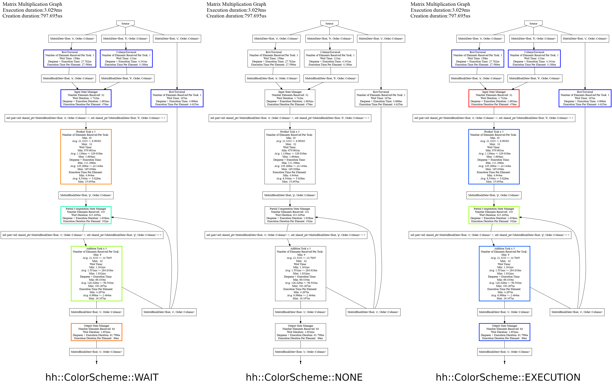
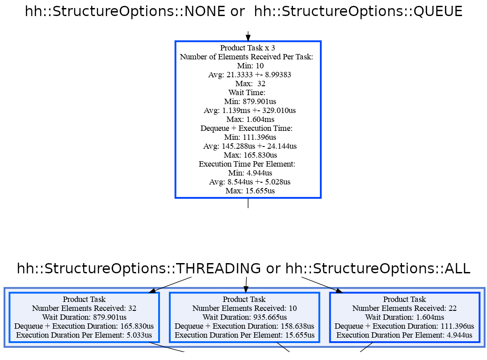
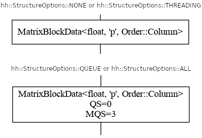
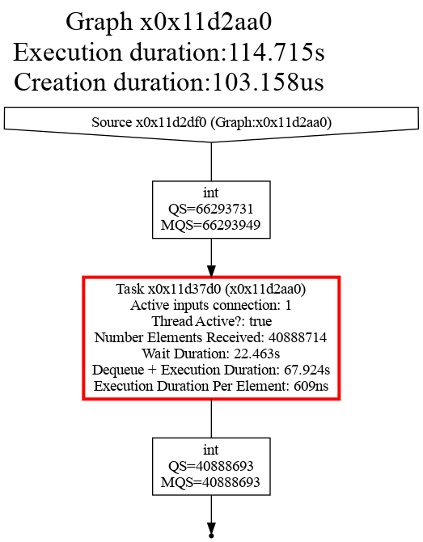
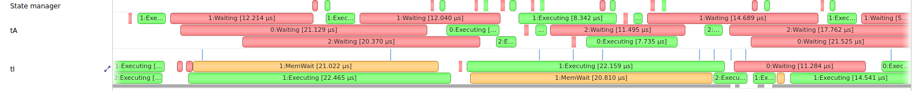

In order to get performance, it is important to understand how the graph behaves. 
One of the main focuses in Hedgehog is to be as explicit as possible following "what is designed is what is executed". 

However, it is not enough to get the best performance on a specific system.
We have developed and added to the main library profiling mechanisms to help understand underlying problems on the design and bottlenecks. 

There are components:
  - [Dot file generation](#dot-file-generation),
  - [The signal handler](#signal-handler),
  - [A compatibility with NVIDIA NVTX](#nvidia-nvtx).

---

# Dot file generation

## API

The dot file generator uses a visitor pattern that visits a graph and its nodes, gathering metrics and serving them under the dot format ([https://graphviz.org/doc/info/lang.html](https://graphviz.org/doc/info/lang.html)). 
The dot generator colors nodes based on the specified color scheme (none, execution time, or wait time). This is useful to analyze the state of the computation and help pinpoint bottlenecks during the execution of the Hedgehog graph. 

Each of the tutorials presents the dot representation of the graph used in the tutorial. 

It is invoked through the graph method: 
```cpp
void createDotFile(
    std::filesystem::path const &dotFilePath, // Path to the file to create
    ColorScheme colorScheme = ColorScheme::NONE, // Color scheme selection
    StructureOptions structureOptions = StructureOptions::NONE, // Graph structure option 
    InputOptions inputOption = InputOptions::GATHERED, // Input presentation option
    DebugOptions debugOption = DebugOptions::NONE, // Debug option
    std::unique_ptr<ColorPicker> colorPicker = std::make_unique<JetColor>(), // Color picker
    bool verbose = false // Verbose flag
);
```

## Options

Here are the function parameters and their options: 
  - dotFilePath: Path to the file to generate, if the file already exists it will be replaced. 
  - colorScheme: Node color scheme used to generate the graph. It could be: 
    - hh::ColorScheme::NONE: Default presentation, no coloration added,
    - hh::ColorScheme::EXECUTION: The nodes are colored depending on the execution (processing) time, 
    - hh::ColorScheme::WAIT: The nodes are colored depending on the wait (idle) time.
  - structureOptions: Way to group nodes (some node can be duplicated as the hh::AbstractTask) and how the edges are presented. It could be: 
    - hh::StructureOptions::NONE: Default presentation, the groups are presented with one node and no extra information is added to the edge.
    - hh::StructureOptions::THREADING: Present all the nodes in a group with different nodes.
    - hh::StructureOptions::QUEUE: Present extra information on the queue (number of elements in the queue / maximum queue size during the execution).
    - hh::StructureOptions::ALL: Combination of hh::StructureOptions::THREADING and hh::StructureOptions::QUEUE.
  - Input options: Shows if the metrics are presented per input type or with all the input types gathered
    - hh::InputOptions::GATHERED: Present the execution time for all input type gathered
    - hh::InputOptions::SEPARATED: Shows the time per input type
  - debugOption: Add information for debugging purpose. It could be:
    - hh::DebugOptions::NONE: Default presentation, no extra information added.
    - hh::DebugOptions::ALL: Shows debug information such as pointer addresses for nodes and edges.
  - colorPicker: Choose the colors used to color the nodes. It could be anything inheriting from the ColorPicker abstraction, we have embedded: 
    - JetColor: Default color picker, following the Jet scheme.
    - BlueToRed: Gradient from pure blue to pure red, blue being the lowest value and red the highest. 
  - verbose: Flag for verbose mode, if true, a message is shown if the file is created or replaced. 

The edges by default present an edge for each type connecting inputs/outputs of nodes.
If the option hh::StructureOptions::QUEUE or hh::StructureOptions::ALL is used, the current number of elements in the queue for this type waiting to be processed is showed alongside the maximum queue size during the whole execution.

## Metrics

The metrics gathered are: 
  - Edge:
    - \[hh::StructureOptions::QUEUE or hh::StructureOptions::ALL\]: queue size and maximum queue size during the execution.
  - (Outer/Main) Graph: 
    - Total graph execution duration
    - Creation duration
  - Task / State Manager: 
    - \[hh::DebugOptions::ALL\]: Number of predecessor nodes connected 
    - \[hh::DebugOptions::ALL\]: Is thread active
    - \[hh::DebugOptions::ALL\]: Number of active threads in the group
    - Number elements received
    - Wait duration (thread idle time)
    - Dequeue + execution duration
    - Execution duration per element
    - \[If memory manager attached\]: Wait duration to acquire memory from the memory manager

All the durations are gathered in nanoseconds with a *std::chrono::system_clock* and presented with the most significant unit (s, ms, us, or ns).

## Cost

In paper [DOI: 10.1109/PAWATM51920.2020.00006](https://doi.org/10.1109/PAWATM51920.2020.00006), we have presented a study about the cost of using this tool.
We have discovered that there is no statistical difference in average between the end-to-end executions duration with and without using this tool. 
Therefore, we always advise users to use this tool to get a profile on every execution because 1) it is "costless" in terms of execution duration and 2) it helps to understand the execution and improve it. 


## Few examples

Here are few examples of dot graph generations. 

### Color schemes

The following presents the graph of [Tutorial 4](tutorial4.html) with different color schemes: 



It presents the three options available on Hedgehog, in order from left to right: coloration depending on the waiting time (idle thread), no coloration, and coloration depending on the execution time. 

### Threading options

The following presents how a node with multiple threads can be presented (here the *ProductTask*):



On top, the *ProductTask* three threads are presented with a single node.
Its metrics (number of elements received, wait time, dequeue + execution time, and the execution time per element) are served with statistics (minimum value, average +- stdev, and maximum value). 
On bottom, each thread is presented with different nodes. The timings for each thread are exactly how the thread was executed within Hedgehog.

### Queue options

The following presents the different queue options. 



By default, on top, only the type flowing through an edge is presented.

When the option StructureOptions::QUEUE or StructureOptions::ALL is used, the current Queue Size (here QS=0), and the Maximum Queue Size during the whole execution (here MQS=3). If the QS is greater than 0, then that means there was data within its queue waiting to be processed when the dot file was generated. Sometimes this can be used to pinpoint issues in the design of a graph, particularly when used in conjunction with the [signal handler](#single-handler) on a deadlocked graph.

### How to use it ?

Analyzing the dot graph presentation provides a variety of insights into how the execution was done within Hedgehog. 
During development, usually it is known which task contains the most complexity and should consume the most execution time. This knowledge can come in handy when visualizing the graph. For instance, when coloring the graph based on execution time, if the most compute intensive task is not highlighting as red, then there is additional overhead being experienced within the graph. This is often a good starting point.

The next piece of the dot graph that is often analyzed is the queue structure. The MQS (Max Queue Size) is extremely useful to identify tasks that have a lot of data waiting to be processed. This could be a result of insufficient parallelism when processing that data or that the source of the data is producing at a much higher rate than what the task is able to process. The MQS is often useful to identify areas of parallelism in the graph and where other tasks are being over utilized. For example, if the MQS is 1, then most likely there is little parallelism available for that task as there is insufficient data flowing. So having more than 1 thread in this case may or may not be of benefit in that implementation. However it could also help indicate areas where optimizations can be applied, such as changing the decomposition strategy to improve the amount of data flowing into that task, so that parallelism can be used to process each element. 

Combining both the execution time analysis and MQS analysis can help identify a variety of behaviors when the graph was executed; such as, data stalling, nodes lacking parallism, *too complex nodes*, or *too big* data. Once pinpointed, you can experiment with the graph by altering various thread configurations for nodes or adjusting data decomposition. For example, if there is a lot of data waiting to be processed (identified by the maximum queue size), then increasing the number of threads attached to that node or improving the throughput within the execute for that node will help with keeping up with the rate that data is being sent. Lastly, if the problem is due to Hedgehog latency (too small data), then it may be worth changing the coarseness of the pieces of data. 

The queue size (QS) can also be important to analyze, particularly when debugging a deadlocked graph. 
In general, a queue size non equal to zero is a problem. 
It could indicate that some input data has not been processed. 
So, either it is wanted because the *canTerminate* method has been designed as such, or the QS can help pinpoint problem node\[s\] that may be the origin of a deadlock. A deadlocked graph can be visualized by using Hedgehog's signal handler integration as described in the [next section](#signal-handler).

The ways to intrepret the dot file depends a lot on how the algorithm operates. To facilitate additional insights into how a node in Hedgehog performs, we have added the *extraPrintingInformation* function. Overriding this function into a task adds the output onto the node in the dot file. Here are some usage examples: (1) Output the data transfer throughput when copying data to/from the GPU, (2) Output the read throughput from disk, or (3) splitting up the computation within a task and timing each component. These are just a few examples of the types of insights that can be used to provide additional metrics to help pinpoint areas of improvement in the design and implementation of a Hedgehog graph.

---

# Signal Handler

One of the most difficult problems that can occur when using Hedgehog and parallel algorithms in general are deadlocks. 
While we can't prevent it from happening, we have added the ablity to visualize the graph when it has entered into a deadlock state. This is achieved by attaching the Hedgehog signal handler to your graph.

The main idea of this tool is to react when an OS signal is sent to the program  (SIGTERM or SIGKILL for example) and create a dot file of the graph. 

```cpp
#include "hedgehog/hedgehog.h"

// Simple task doing nothing
class TaskIntInt : public hh::AbstractTask<1, int, int>{
  void execute(std::shared_ptr<int> ptr) override {
    this->addResult(ptr);
  }
};


int main() {
  // Graph's creation
  hh::Graph<1, int, int> g; 

  auto t = std::make_shared<TaskIntInt>();

  g.inputs(t);
  g.outputs(t);

  // Register the graph to the GraphSignalHandler
  hh::GraphSignalHandler<1, int, int>::registerGraph(&g);
  
  // Register the signals
  hh::GraphSignalHandler<1, int, int>::registerSignal(SIGABRT);
  hh::GraphSignalHandler<1, int, int>::registerSignal(SIGKILL);
  hh::GraphSignalHandler<1, int, int>::registerSignal(SIGTERM);

  // Execute the graph 
  g.executeGraph();

  for(int i = 0; i < 1000000000; ++i){
    g.pushData(std::make_shared<int>(i));
  }

  g.finishPushingData();

  g.waitForTermination();
}

```

So if the graph is deadlocked, and you have attached the SIGTERM or SIGKILL signals to your graph, then when the program is terminated or killed then the graph at that point in time is outputted as a dot file.

For example, here is the graph when signal 15 is sent (SIGTERM) for the previous example graph: 



One common source of deadlock is also related to incorrect usage when executing the graph and then forgetting to mark that the graph has finished pushing data. So try to follow the structure: (1) executeGraph, (2) finishPushingData, and (3) waitForTermination. This will ensure that at minimum the graph will correctly send appropriate terminations to the inputs of the graph. If the graph deadlocks beyond this case, then there could be incorrectly handled cycles or other conditions that prevent a task from checking *canTerminate*.

---

# NVIDIA NVTX 

The last tool included in Hedgehog is an interface to the NVTX tool from NVIDIA. 
The NVTX library allows us to annotate events in the code (different states of the nodes in the graph), and presents them in a visualization with the [NVIDIA Nsight VSE tool](https://developer.nvidia.com/nsight-systems).

If NVTX is available in your system, and activated in the CMAKE (*ENABLE_NVTX* option) the events collection will be activated.
Once activated, the executable can be invoked through the NVIDIA Nsight VSE tool and the following graph can be presented: 



On the left the different nodes' name are presented, and for each of the nodes the different events are presented in a timely fashion. 
In red are the waiting (idle) thread events, in green are the processing events, and in yellow are the wait for memory from a memory manager events. Hovering over the red events provides an additional payload variable, which indicates the queue size at that point in time.
